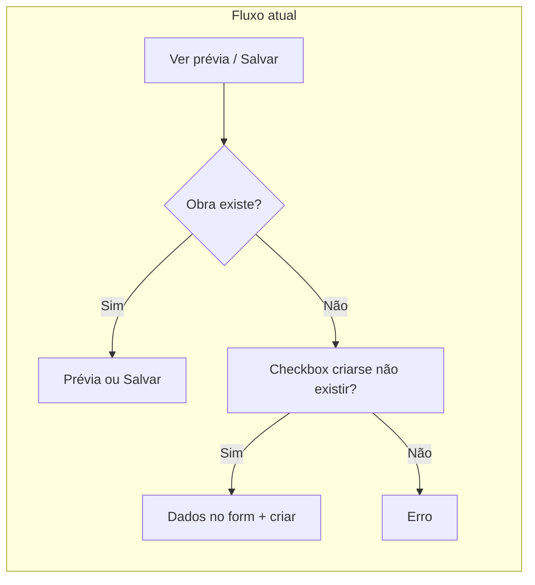
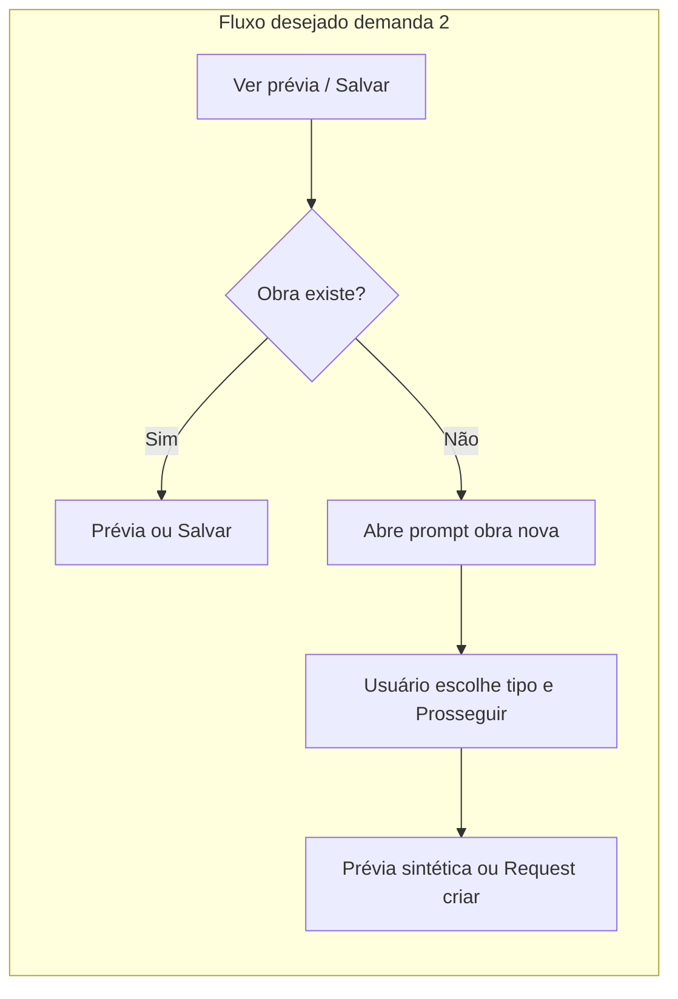

# Relatório de Alterações para Demanda — Obra nova sem checkbox (segunda demanda)

## Resumo da demanda

A segunda demanda do ficheiro [docs/demandas para a tela de atualização de obra](docs/demandas%20para%20a%20tela%20de%20atualização%20de%20obra) é: **o checkbox "Criar obra se não existir" é desnecessário; se a obra não existe, deve-se criá-la, abrindo apenas algum tipo de prompt avisando que é uma obra nova e permitindo escolher um tipo caso o usuário escolha prosseguir.** Ou seja: (1) remover o checkbox; (2) quando a obra não existir (404), exibir um prompt/modal com aviso de obra nova e seleção de tipo; (3) se o usuário prosseguir, criar a obra com os dados escolhidos.

## Âmbito da análise

- **Frontend:** componente de atualização de posição ([atualizar-posicao.component.ts](frontend/src/app/features/obras/atualizar-posicao/atualizar-posicao.component.ts), [atualizar-posicao.component.html](frontend/src/app/features/obras/atualizar-posicao/atualizar-posicao.component.html)), serviço [atualizar-posicao.service.ts](frontend/src/app/application/atualizar-posicao.service.ts) (interface `AtualizarPosicaoRequest`), testes do componente e E2E que referenciam o checkbox ou a mensagem "Criar se não existir".
- **Backend:** API e command já suportam criação quando `CriarSeNaoExistir` é true e `NomeParaCriar`, `TipoParaCriar` e `OrdemPreferenciaParaCriar` são enviados; **não é necessário alterar contrato nem comportamento** — apenas a forma como o frontend decide enviar `criarSeNaoExistir: true` e os dados de criação muda (via prompt em vez de checkbox).
- **Premissas:** O "prompt" pode ser um segundo dialog/modal (reutilizando o `DialogService` existente em [shared/dialog/](frontend/src/app/shared/dialog/)) com mensagem, seletor de tipo (e opcionalmente nome e ordem de preferência com valores default), e botões "Prosseguir" / "Cancelar". Ao prosseguir, o componente de atualização usa os dados escolhidos para prévia sintética (em "Ver prévia") ou para o payload de criação (em "Salvar"). Nome default = valor do identificador digitado; ordem default = 0.

## Alterações necessárias

### 1. Remover o checkbox e o bloco condicional "Dados da nova obra" do template

**Onde:** frontend, [atualizar-posicao.component.html](frontend/src/app/features/obras/atualizar-posicao/atualizar-posicao.component.html)  
**Tipo:** Remover  
**Descrição:** Remover o bloco do checkbox "Criar obra se não existir" (linhas 60–65) e o bloco `@if (criarSeNaoExistir) { ... }` que exibe "Dados da nova obra" (nome, tipo, ordem de preferência). Esses dados passarão a ser preenchidos apenas no prompt de obra nova, não no formulário principal.  
**Requisito atendido:** Eliminar o checkbox e a secção condicional no formulário.

---

### 2. Introduzir componente ou dialog "Prompt obra nova"

**Onde:** frontend, nova peça em `shared/` ou dentro de `features/obras/` (ex.: `atualizar-posicao/prompt-obra-nova.component.ts`)  
**Tipo:** Criar  
**Descrição:** Criar um pequeno componente (ou template inline) para o prompt "É uma obra nova. Deseja cadastrar?" com: (a) mensagem de aviso; (b) campo para escolher o tipo da obra (select com `TipoObra`); (c) opcionalmente nome (default = valor do identificador) e ordem de preferência (default 0); (d) botões "Prosseguir" e "Cancelar". Deve ser aberto via `DialogService.open()` e retornar (ex.: `DialogRef`) com resultado `{ prosseguir: true, nome: string, tipo: TipoObra, ordemPreferencia: number }` ou `undefined` se cancelar. Pode ser um componente standalone reutilizando estilos do dialog existente.  
**Requisito atendido:** Aviso de obra nova e escolha de tipo antes de prosseguir.

---

### 3. Alterar fluxo de "Ver prévia" ao receber 404

**Onde:** frontend, [atualizar-posicao.component.ts](frontend/src/app/features/obras/atualizar-posicao/atualizar-posicao.component.ts) (método `verPreview`)  
**Tipo:** Alterar  
**Descrição:** Quando a API retornar 404 (obra não encontrada), em vez de exibir a mensagem "Obra não encontrada. Marque 'Criar se não existir' para cadastrar." ou de depender de `criarSeNaoExistir`, abrir o dialog de "Prompt obra nova" (item 2). Se o usuário prosseguir, guardar no componente o estado "dados de criação pendentes" (nome, tipo, ordem) e exibir a prévia sintética (reutilizando a lógica atual de `construirPreviaSinteticaObraNova`); se cancelar, exibir mensagem informativa (ex.: "Obra não encontrada.") sem erro agressivo. Remover a dependência de `criarSeNaoExistir` no tratamento do 404.  
**Requisito atendido:** Ao detectar obra inexistente na prévia, mostrar prompt e, ao prosseguir, prévia sintética.

---

### 4. Alterar fluxo de "Salvar" para obra nova e para 404

**Onde:** frontend, [atualizar-posicao.component.ts](frontend/src/app/features/obras/atualizar-posicao/atualizar-posicao.component.ts) (método `salvar`)  
**Tipo:** Alterar  
**Descrição:** (a) Se já existir estado de "obra nova" (dados preenchidos pelo prompt após "Ver prévia" ou por um prompt aberto após falha de salvar), montar o request com `criarSeNaoExistir: true`, `nomeParaCriar`, `tipoParaCriar` e `ordemPreferenciaParaCriar` a partir desse estado. (b) Se não existir esse estado e a chamada PATCH retornar 404, abrir o mesmo "Prompt obra nova"; ao prosseguir, reenviar o request com `criarSeNaoExistir: true` e os dados escolhidos no prompt. Remover o uso da propriedade `criarSeNaoExistir` no request; o envio de criação passa a depender apenas do estado "dados de criação pendentes" (preenchido pelo prompt).  
**Requisito atendido:** Criação automática após confirmação no prompt, sem checkbox.

---

### 5. Ajustar estado e propriedades do componente

**Onde:** frontend, [atualizar-posicao.component.ts](frontend/src/app/features/obras/atualizar-posicao/atualizar-posicao.component.ts)  
**Tipo:** Alterar  
**Descrição:** Remover a propriedade `criarSeNaoExistir`. Manter (ou renomear para uso interno) `nomeParaCriar`, `tipoParaCriar` e `ordemPreferenciaParaCriar` como estado preenchido pelo resultado do "Prompt obra nova" (não mais pelo formulário). Garantir que `construirPreviaSinteticaObraNova` use esse estado. Injetar `DialogService` no componente para abrir o prompt.  
**Requisito atendido:** Modelo do componente alinhado ao novo fluxo (sem checkbox, estado vindo do prompt).

---

### 6. Manter contrato do serviço e da API

**Onde:** frontend [atualizar-posicao.service.ts](frontend/src/app/application/atualizar-posicao.service.ts) — interface `AtualizarPosicaoRequest`  
**Tipo:** Alterar (mínimo)  
**Descrição:** A interface `AtualizarPosicaoRequest` continua a ter `criarSeNaoExistir: boolean` e os campos opcionais de criação; o componente passará a enviar `criarSeNaoExistir: true` apenas quando o usuário tiver confirmado no prompt. Nenhuma alteração no backend (command, handler, validator, controller) é necessária.  
**Requisito atendido:** Integração com a API existente sem mudança de contrato no backend.

---

### 7. Atualizar testes do componente de atualização de posição

**Onde:** frontend, [atualizar-posicao.component.spec.ts](frontend/src/app/features/obras/atualizar-posicao/atualizar-posicao.component.spec.ts)  
**Tipo:** Alterar  
**Descrição:** Remover ou adaptar testes que dependem do checkbox (ex.: `data-testid="atualizar-posicao-criar"`), da propriedade `criarSeNaoExistir` ou da mensagem "Criar se não existir". Incluir cenários: (a) 404 em "Ver prévia" → abre prompt; ao prosseguir no prompt → prévia sintética definida; (b) 404 em "Salvar" → abre prompt; ao prosseguir → segundo request com `criarSeNaoExistir: true`. Mockar `DialogService.open()` para o componente de prompt e simular retorno "prosseguir" ou "cancelar".  
**Requisito atendido:** Cobertura do novo fluxo e remoção de expectativas obsoletas.

---

### 8. Ajustar testes E2E se existirem para o checkbox

**Onde:** frontend, [e2e/obras.spec.ts](frontend/e2e/obras.spec.ts) (ou outro spec que use atualizar-posicao)  
**Tipo:** Alterar  
**Descrição:** Se houver passos que marcam "Criar obra se não existir" ou que verificam a presença desse checkbox, remover ou substituir por fluxo que abre o prompt de obra nova, escolhe o tipo e prossegue.  
**Requisito atendido:** E2E alinhado ao novo comportamento.

---

## Resumo executivo

- **Total de itens de alteração:** 8  
- **Por tipo:** Criar (1), Alterar (5), Remover (1), Integrar (0) — o item 6 é alteração mínima de uso da interface.  
- **Dependências:** O item 2 (componente/dialog do prompt) é pré-requisito para os itens 3 e 4. Itens 3, 4 e 5 são interdependentes no mesmo componente. Itens 7 e 8 dependem do novo fluxo estar implementado.

## Diagrama do novo fluxo

---

## Estado TDD (testes escritos primeiro)

Testes criados/alterados para guiar a implementação (quadro-de-recompensas + TDD):

- **PromptObraNovaComponent**  
  - Novo: `frontend/src/app/features/obras/atualizar-posicao/prompt-obra-nova.component.ts` (stub) e `prompt-obra-nova.component.spec.ts`.  
  - Spec cobre: dados iniciais (nome default, tipo, ordem), botões Prosseguir/Cancelar, fechamento com resultado ou `undefined`.  
  - Stub mínimo permite os testes do prompt passarem; o componente pode ser evoluído (mensagem, estilos, opções de tipo) na implementação.
- **AtualizarPosicaoComponent**  
  - Template: testes que **falham** até a implementação: não exibir checkbox `atualizar-posicao-criar` nem secção "Dados da nova obra".  
  - verPreview: testes que **falham** até a implementação: ao receber 404, abrir `DialogService.open(PromptObraNovaComponent, { data: { nomeDefault } })`; ao prosseguir → prévia sintética; ao cancelar → mensagem "Obra não encontrada".  
  - salvar: testes que **falham** até a implementação: (1) quando há estado de dados de criação (nome/tipo/ordem), enviar request com `criarSeNaoExistir: true`; (2) quando PATCH retorna 404, abrir prompt e ao prosseguir reenviar com `criarSeNaoExistir: true`.  
  - Mock de `DialogService` e de `DialogRef.afterClosed` (Observable) já configurados no spec.
- **E2E**  
  - `frontend/e2e/obras.spec.ts`: adicionado teste "Demanda 2: não deve exibir o checkbox Criar obra se não existir".  
  - **Falha** até o checkbox ser removido do template.

**Suíte atual:** 126 passando, 5 falhando (todas esperadas até implementar os itens 1–5 do relatório). Executar com `./scripts/frontend-test-docker.sh` (Node 22).