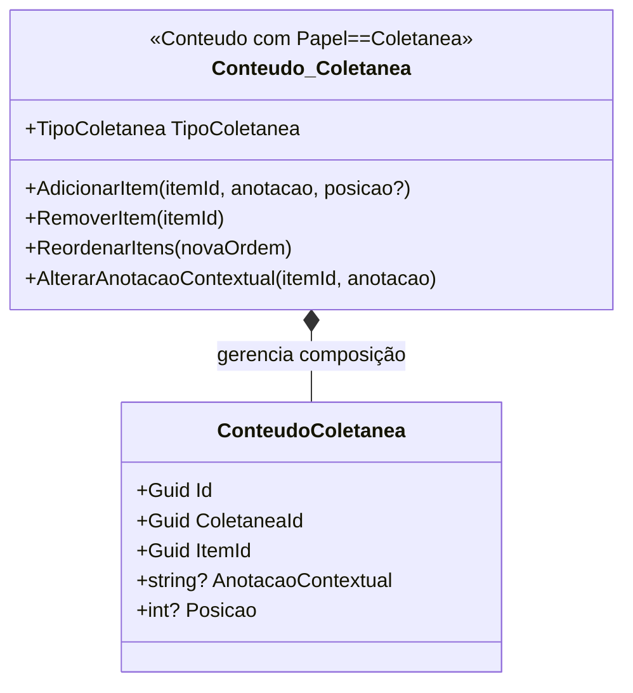

# Plan 2: Modelo Tático — BC Acervo

## Goal
Criar `docs/domain/acervo.md` com o modelo tático DDD completo do BC Acervo, incluindo os três agregados, invariantes, eventos de domínio, repositórios e mapeamento dos Cenários 1–5 do Apêndice A.

## Context
O BC Acervo é o contexto principal (Prioridade 1). É a base de tudo — todos os outros BCs dependem de alguma interface que o Acervo implementa. O research (01-RESEARCH.md, seção 1.1) identificou três agregados: `Conteudo`, `Coletanea` (mesmo tipo com papel diferente) e `Categoria`. Esta tarefa formaliza esse design em um documento estruturado e verificável. Requisito ARQ-01 exige modelagem tática completa dos BCs core.

## Tasks

<task id="2.1" title="Criar docs/domain/acervo.md — Agregados e Value Objects">
<read_first>
- `especificacoes/1  - definicao-de-dominio.md` — seções 4.1 a 4.7 (coletâneas, conteúdos, fontes, progresso, categorias, relações, imagens) + Apêndice A (7 cenários)
- `especificacoes/3 - mapa-de-contexto.md` — linguagem ubíqua do BC Acervo, padrões de relacionamento com outros BCs
- `.planning/phases/01-modelagem-t-tica-ddd/01-RESEARCH.md` — seção 1.1 (agregados Conteudo, Coletanea, Categoria), seção 1.3 (contratos), seção 2.2 (template de documento de BC)
- `especificacoes/5 - technical-standards.md` — seção 6.1 (estrutura de entidades) e seção 4.6 (regra usuarioId obrigatório em queries)
</read_first>

<action>
Criar `docs/domain/acervo.md` com o seguinte conteúdo estruturado. Cada seção deve ser preenchida com os valores concretos extraídos dos documentos de especificação — não use placeholders genéricos.

**Estrutura do documento:**

```markdown
# BC Acervo — Modelo Tático

**Classificação:** Principal (Prioridade 1)
**Linguagem Ubíqua:** [extraída do Mapa de Contexto v1 — termos do BC Acervo]
**Projeto .NET:** `DiarioDeBordo.Module.Acervo`
**Interfaces definidas em:** `DiarioDeBordo.Core`

---

## Agregados

### Conteudo (Aggregate Root)

**Responsabilidade:** Proteger a consistência dos dados de um item do acervo — seus metadados, fontes, progresso, histórico de ações, imagens e ganchos.

#### Entidades

| Nome | Atributos | Papel dentro do agregado |
|---|---|---|
| Conteudo (AR) | Id: Guid; Titulo: string (obrigatório); Descricao: string?; Anotacoes: string?; Nota: decimal? [0,10]; Classificacao: enum?; Formato: enum FormatoMidia; Subtipo: string?; Papel: enum PapelConteudo {Item, Coletanea}; TipoColetanea: enum? {Guiada, Miscelanea, Subscricao}; UsuarioId: Guid; CriadoEm: DateTimeOffset; AtualizadoEm: DateTimeOffset | Aggregate Root |
| Fonte | Id: Guid; ConteudoId: Guid; Tipo: enum TipoFonte {Url, ArquivoLocal, Rss, Identificador}; Valor: string; Plataforma: string?; Prioridade: int (único por conteúdo) | Entidade filha — ciclo de vida dependente |
| HistoricoAcao | Id: Guid; ConteudoId: Guid; TipoAcao: enum; Detalhe: string?; OcorridoEm: DateTimeOffset | Imutável após criação; apenas o próprio Conteudo cria |
| ImagemConteudo | Id: Guid; ConteudoId: Guid; OrigemTipo: enum {Manual, Automatica}; Caminho: string; Principal: bool | Máximo 20 por conteúdo; máximo 10MB por imagem |
| Gancho | Id: Guid; ConteudoId: Guid; Posicao: string; Anotacao: string? | Relacionado ao conteúdo específico |

#### Value Objects

| Nome | Campos | Invariante |
|---|---|---|
| Progresso | Estado: enum {NaoIniciado, EmAndamento, Concluido}; PosicaoAtual: string?; HistoricoConsumo: List<RegistroConsumo>; NotaManual: string? | Estado é global ao conteúdo — compartilhado entre coletâneas |
| RegistroConsumo | Data: DateOnly; PorcentagemConsumida: decimal? | Imutável após criação |

#### Invariantes

| # | Invariante | Violação produz |
|---|---|---|
| I-01 | `Titulo` nunca nulo ou vazio | `DomainException("Título é obrigatório")` |
| I-02 | `TipoColetanea` nulo quando `Papel == Item`; obrigatório quando `Papel == Coletanea` | `DomainException("TipoColetanea obrigatório para Coletânea")` |
| I-03 | `Nota` no intervalo [0, 10] quando presente | `DomainException("Nota deve estar entre 0 e 10")` |
| I-04 | Máximo 20 imagens por conteúdo | `DomainException("Limite de 20 imagens atingido")` |
| I-05 | Máximo 10MB por imagem | `DomainException("Imagem excede 10MB")` |
| I-06 | Apenas uma `ImagemConteudo` com `Principal == true` quando houver ≥ 1 imagem | `DomainException("Apenas uma imagem pode ser principal")` |
| I-07 | `Fonte.Prioridade` única por conteúdo — sem duas fontes com a mesma prioridade | `DomainException("Prioridade já utilizada por outra fonte")` |

#### Eventos de Domínio Publicados

| Evento | Quando publicado | Handlers esperados |
|---|---|---|
| `ConteudoCriadoNotification(ConteudoId, Titulo, UsuarioId)` | Após persistência de novo Conteudo | ViewModels de listagem que precisam atualizar |
| `ProgressoAlteradoNotification(ConteudoId, Estado, PosicaoAtual)` | Quando Progresso.Estado ou PosicaoAtual muda | Module.Reproducao (UI de reprodução), ViewModels |
| `ItemFeedPersistidoNotification(ConteudoId, Titulo)` | Após handler de PersistirItemFeedCommand | ViewModels do Acervo que monitoram novas chegadas |

#### Repositório

```csharp
// Definido em DiarioDeBordo.Core — implementado em DiarioDeBordo.Module.Acervo.Infrastructure
public interface IConteudoRepository
{
    Task AdicionarAsync(Conteudo conteudo, CancellationToken ct);
    Task<Conteudo?> ObterPorIdAsync(Guid id, Guid usuarioId, CancellationToken ct);
    Task AtualizarAsync(Conteudo conteudo, CancellationToken ct);
    Task RemoverAsync(Guid id, Guid usuarioId, CancellationToken ct);
    Task<Conteudo?> BuscarPorUrlFonteAsync(Guid usuarioId, string urlNormalizada, CancellationToken ct);
    Task<Conteudo?> BuscarPorIdentificadorFonteAsync(Guid usuarioId, string plataforma, string identificador, CancellationToken ct);
}
// REGRA: todo método inclui usuarioId — sem exceções (Padrões Técnicos v4, seção 4.6)
```

#### Diagrama Mermaid

```mermaid
classDiagram
    class Conteudo {
        +Guid Id
        +string Titulo
        +string? Descricao
        +string? Anotacoes
        +decimal? Nota
        +FormatoMidia Formato
        +PapelConteudo Papel
        +TipoColetanea? TipoColetanea
        +Guid UsuarioId
        +Progresso Progresso
        +AlterarProgresso(estado, posicao)
        +AdicionarFonte(tipo, valor, prioridade)
        +AdicionarImagem(caminho, origem)
        +DefinirImagemPrincipal(imagemId)
        +AdicionarGancho(posicao, anotacao)
    }
    class Fonte {
        +Guid Id
        +TipoFonte Tipo
        +string Valor
        +int Prioridade
    }
    class HistoricoAcao {
        +Guid Id
        +TipoAcao TipoAcao
        +string? Detalhe
        +DateTimeOffset OcorridoEm
    }
    class ImagemConteudo {
        +Guid Id
        +OrigemImagem OrigemTipo
        +string Caminho
        +bool Principal
    }
    class Gancho {
        +Guid Id
        +string Posicao
        +string? Anotacao
    }
    class Progresso {
        +EstadoProgresso Estado
        +string? PosicaoAtual
        +string? NotaManual
    }
    Conteudo *-- Fonte : contém (0..20)
    Conteudo *-- HistoricoAcao : contém (imutável)
    Conteudo *-- ImagemConteudo : contém (0..20, máx 10MB)
    Conteudo *-- Gancho : contém
    Conteudo *-- Progresso : possui (1:1)
```

---

### Coletanea (Aggregate Root)

**Responsabilidade:** Gerenciar a composição de itens em uma coletânea, incluindo a ordem (Guiadas), as anotações contextuais nas relações, e a prevenção de ciclos em composições de coletâneas.

**Nota importante:** `Coletanea` é implementada como um `Conteudo` com `Papel == Coletanea`. É o mesmo tipo — não existe uma classe `Coletanea` separada. A distinção é de responsabilidade, não de tipo.

#### Entidades adicionais (além das de Conteudo)

| Nome | Atributos | Papel dentro do agregado |
|---|---|---|
| ConteudoColetanea | Id: Guid; ColetaneaId: Guid; ItemId: Guid; AnotacaoContextual: string?; Posicao: int? (apenas Guiadas) | Pertence ao ciclo de vida da coletânea — gerenciada por ela |

#### Value Objects adicionais

| Nome | Campos | Invariante |
|---|---|---|
| OrdemItem | Posicao: int | Apenas para Guiadas; posições sem lacunas ou duplicações |

#### Invariantes adicionais

| # | Invariante | Violação produz |
|---|---|---|
| I-08 | Uma Coletanea não pode conter a si mesma, direta ou transitivamente | `DomainException("Operação criaria ciclo na composição")` — verificado via DFS antes da adição |
| I-09 | Coletânea Guiada: posições dos itens são únicas, sem lacunas (1, 2, 3...) | `DomainException("Posição duplicada ou com lacuna")` |
| I-10 | `TipoColetanea` é imutável após criação | `DomainException("TipoColetanea não pode ser alterado após criação")` |

#### Algoritmo de detecção de ciclos

```
AdicionarItem(ColetaneaId, ItemId):
  Se Item é Coletanea:
    Executar DFS a partir de ItemId no grafo de composição
    Se ColetaneaId for encontrado no subgrafo descendente → CICLO → rejeitar
  Senão:
    Adicionar ConteudoColetanea normalmente
Complexidade: O(V+E) — linear no número de coletâneas e relações
```

#### Repositório

```csharp
public interface IColetaneaRepository
{
    Task AdicionarAsync(Conteudo coletanea, CancellationToken ct);
    Task<Conteudo?> ObterPorIdAsync(Guid id, Guid usuarioId, CancellationToken ct);
    Task<IReadOnlyList<Guid>> ObterDescendentesAsync(Guid coletaneaId, Guid usuarioId, CancellationToken ct);
    // ObterDescendentesAsync é usado pelo handler de AddItem para verificação de ciclo
    Task AtualizarAsync(Conteudo coletanea, CancellationToken ct);
}
```

#### Diagrama Mermaid



---

### Categoria (Aggregate Root)

**Responsabilidade:** Manter unicidade case-insensitive de categorias por usuário; fornecer autocompletar.

#### Entidade

| Nome | Atributos | Invariante |
|---|---|---|
| Categoria | Id: Guid; UsuarioId: Guid; Nome: string; NomeNormalizado: string (lowercase) | NomeNormalizado único por UsuarioId — impede duplicações case-insensitive |

#### Repositório

```csharp
public interface ICategoriaRepository
{
    Task<Categoria> ObterOuCriarAsync(Guid usuarioId, string nome, CancellationToken ct);
    // ObterOuCriarAsync é atômico — garante que "Romance" e "romance" são o mesmo registro
    Task<IReadOnlyList<Categoria>> ListarComAutocompletarAsync(Guid usuarioId, string prefixo, CancellationToken ct);
    // prefixo é comparado contra NomeNormalizado (lowercase)
}
```

---

## Entidades fora dos agregados (referenciadas por ID)

| Entidade | Justificativa para estar fora | Gerenciada por |
|---|---|---|
| `RelacaoConteudo` | Bidirecionalidade exige gerenciamento fora dos dois agregados; service layer gerencia a criação das duas direções | Application service (não dentro dos agregados) |
| `ConteudoCategoria` | Tabela de junção — acesso via consulta, não via agregado | Application service |

---

## Interfaces publicadas para outros BCs

Definidas em `DiarioDeBordo.Core` — implementadas em `DiarioDeBordo.Module.Acervo`:

```csharp
// Consumida por Module.Agregacao:
public interface ISubscricaoFontesProvider
{
    Task<IReadOnlyList<FonteSubscricao>> ObterFontesAsync(
        Guid usuarioId, Guid coletaneaSubscricaoId, CancellationToken ct);
}
public sealed record FonteSubscricao(Guid FonteId, string Tipo, string Valor, string? Plataforma);

// Consumida por Module.Agregacao — verifica deduplicação antes de persistir:
public interface IConteudoRegistradoProvider
{
    Task<bool> ExisteConteudoPorUrlAsync(Guid usuarioId, string urlNormalizada, CancellationToken ct);
    Task<bool> ExisteConteudoPorIdentificadorAsync(Guid usuarioId, string plataforma, string identificador, CancellationToken ct);
}

// Consumida por Module.Reproducao:
public interface IConteudoParaReproducaoProvider
{
    Task<ConteudoReproducaoDto?> ObterAsync(Guid id, Guid usuarioId, CancellationToken ct);
}
public sealed record ConteudoReproducaoDto(
    Guid Id, string Titulo, FormatoMidia Formato,
    IReadOnlyList<FonteOrdenada> FontesOrdenadas, IReadOnlyList<GanchoDto> Ganchos);

// Consumida por Module.Portabilidade:
public interface IDadosExportaveisProvider
{
    Task<ExportacaoDto> ExportarAsync(Guid usuarioId, CancellationToken ct);
}
```

## Commands e Handlers do BC Acervo

```csharp
// Enviado por Module.Agregacao — handler em Module.Acervo:
public sealed record PersistirItemFeedCommand(
    Guid UsuarioId,
    string Titulo,
    string? Descricao,
    string? UrlFonte,
    string? ThumbnailUrl,
    FormatoMidia Formato,
    Guid ColetaneaSubscricaoId
) : IRequest<Result<Guid>>;
// Invariantes do handler:
// 1. Verificar deduplicação por URL ou identificador de plataforma antes de criar
// 2. Se duplicata: associar à coletânea e retornar ID existente
// 3. Se novo: criar Conteudo com dados do ItemFeedDto
// 4. Registrar HistoricoAcao.Criacao no novo conteúdo
// 5. Retornar Result<Guid> — nunca lançar exceção para fluxos esperados
// 6. Após persistência: publicar ItemFeedPersistidoNotification
```

---

## Cenários do Apêndice A cobertos

### Cenário 1: "Crio listas de filmes temáticas e anoto 'esse não achei dublado'"

**Caminho no modelo:**
1. Usuário cria `Conteudo` com `Formato = Video`, `Subtipo = "filme"`, preenchendo `Titulo` (obrigatório) e `Anotacoes` (campo de texto livre)
2. Usuário cria `Conteudo` com `Papel = Coletanea`, `TipoColetanea = Miscelanea` — a lista temática
3. `Coletanea.AdicionarItem(filmeId, anotacaoContextual: "assistir em dia chuvoso")` → cria `ConteudoColetanea` com `AnotacaoContextual`
4. A anotação "não achei dublado" fica em `Conteudo.Anotacoes` (global); "assistir em dia chuvoso" fica em `ConteudoColetanea.AnotacaoContextual` (específica da relação com essa lista)

**Entidades envolvidas:** `Conteudo`, `Conteudo_Coletanea` (Papel=Coletanea), `ConteudoColetanea.AnotacaoContextual`
**Sem ambiguidade:** Distinção clara entre anotação global (no conteúdo) e contextual (na relação coletânea-item) — resolvida no modelo.

### Cenário 2: "CDs físicos com playlists e fallback para Spotify ou YouTube"

**Caminho no modelo:**
1. Cada música: `Conteudo` com `Formato = Audio`, `Subtipo = "musica"`
2. `Conteudo.AdicionarFonte(tipo: ArquivoLocal, valor: "/path/musica.mp3", prioridade: 1)`
3. `Conteudo.AdicionarFonte(tipo: Url, valor: "spotify://...", prioridade: 2)`
4. `Conteudo.AdicionarFonte(tipo: Url, valor: "youtube.com/...", prioridade: 3)`
5. Playlist: `Conteudo` com `Papel = Coletanea`, `TipoColetanea = Miscelanea`
6. Invariante I-07 garante que prioridades 1, 2, 3 são únicas por conteúdo

**Entidades envolvidas:** `Conteudo`, `Fonte` (múltiplas, prioridade única)

### Cenário 3: "Caderno físico de desenhos"

**Caminho no modelo:**
1. `Conteudo` com `Formato = Nenhum` (sem mídia digital), sem `Fonte`
2. Título, anotações, categorias preenchidos normalmente
3. Fotos das páginas: `Conteudo.AdicionarImagem(caminho, origem: Manual)` — invariante I-04 (max 20) aplicado
4. Progresso manual: `Conteudo.AlterarProgresso(EmAndamento, posicao: "página 30")`

**Entidades envolvidas:** `Conteudo`, `Progresso` (com `PosicaoAtual` manual), `ImagemConteudo`

### Cenário 4: "Plano de estudo com artigos, vídeos, playlists e coletâneas aninhadas"

**Caminho no modelo:**
1. Coletânea Guiada raiz: `Conteudo` (Papel=Coletanea, TipoColetanea=Guiada) — "Plano de Estudo Programação"
2. Coletânea filha: `Conteudo` (Papel=Coletanea, TipoColetanea=Guiada) — "Fundamentos de Cybersecurity"
3. `ColetaneaRaiz.AdicionarItem(coletaneaFilhaId, posicao: 3)` → detecção de ciclo via DFS — nenhum ciclo, item adicionado
4. Itens simples: artigos (`Formato=Texto`), vídeos (`Formato=Video`) adicionados com posições explícitas

**Invariante verificada:** I-08 (anti-ciclo), I-09 (posições únicas sem lacunas)

### Cenário 5: "Franquia Resident Evil — jogos, filmes e livros"

**Caminho no modelo:**
1. Coletânea mãe: "Resident Evil" — `TipoColetanea = Guiada`
2. Coletâneas filhas: "RE — Jogos" (Guiada), "RE — Filmes" (Guiada), "RE — Livros" (Guiada)
3. Adição das coletâneas filhas à mãe: DFS verifica ausência de ciclos em cada adição
4. Jogos (`Formato = Interativo`), filmes (`Formato = Video`), livros (`Formato = Texto`) como itens das coletâneas filhas
5. `Conteudo.Progresso` é global — se RE4 aparece em "RE — Jogos" e em outra coletânea, progresso refletido em ambas

**Invariante verificada:** I-08 (anti-ciclo), composição ilimitada de profundidade

---

## Mapeamento de Invariantes → Testes Futuros (Phase 2)

| Invariante | Método de teste previsto |
|---|---|
| I-01: Título obrigatório | `ConteudoTests.CriarComTituloVazio_LancaException()` |
| I-02: TipoColetanea obrigatório para Coletanea | `ConteudoTests.CriarColetaneaSemTipo_LancaException()` |
| I-03: Nota [0,10] | `ConteudoTests.CriarComNota11_LancaException()` |
| I-04: Máximo 20 imagens | `ConteudoTests.AdicionarVigesimaImagemMais1_LancaException()` |
| I-07: Prioridade única de fonte | `ConteudoTests.AdicionarFonteComPrioridadeDuplicada_LancaException()` |
| I-08: Ciclo em coletâneas | `ColetaneaTests.AdicionarItemCriaCiclo_LancaException()` |
| I-09: Posições sem lacunas (Guiada) | `ColetaneaTests.AdicionarItemComPosicaoLacuna_LancaException()` |
| I-10: TipoColetanea imutável | `ColetaneaTests.AlterarTipoColetanea_LancaException()` |
| Deduplicação por URL | `DeduplicacaoTests.PersistirItemComUrlExistente_RetornaIdExistente()` |
| Paginação obrigatória | `AcervoTests.ListarConteudosSemPaginacao_LancaException()` |
```

A seção de linguagem ubíqua deve ser preenchida com os termos do Mapa de Contexto v1 — leia `especificacoes/3 - mapa-de-contexto.md` e extraia os termos definidos para o BC Acervo.
</action>

<acceptance_criteria>
- [ ] `docs/domain/acervo.md` existe
- [ ] `docs/domain/acervo.md` contém "IConteudoRepository"
- [ ] `docs/domain/acervo.md` contém "IColetaneaRepository"
- [ ] `docs/domain/acervo.md` contém "ICategoriaRepository"
- [ ] `docs/domain/acervo.md` contém "ISubscricaoFontesProvider"
- [ ] `docs/domain/acervo.md` contém "IConteudoParaReproducaoProvider"
- [ ] `docs/domain/acervo.md` contém "PersistirItemFeedCommand"
- [ ] `docs/domain/acervo.md` contém "ItemFeedPersistidoNotification"
- [ ] `docs/domain/acervo.md` contém "ProgressoAlteradoNotification"
- [ ] `docs/domain/acervo.md` contém "## Cenários do Apêndice A cobertos"
- [ ] `docs/domain/acervo.md` contém "Cenário 1"
- [ ] `docs/domain/acervo.md` contém "Cenário 2"
- [ ] `docs/domain/acervo.md` contém "Cenário 3"
- [ ] `docs/domain/acervo.md` contém "Cenário 4"
- [ ] `docs/domain/acervo.md` contém "Cenário 5"
- [ ] `docs/domain/acervo.md` contém "```mermaid"
- [ ] `docs/domain/acervo.md` contém "classDiagram"
- [ ] `docs/domain/acervo.md` contém "AnotacaoContextual"
- [ ] `docs/domain/acervo.md` contém "DFS" (algoritmo de detecção de ciclos)
- [ ] `docs/domain/acervo.md` contém "## Mapeamento de Invariantes → Testes Futuros"
- [ ] `grep -c "| I-" docs/domain/acervo.md` retorna ≥ 10 (pelo menos 10 invariantes documentadas)
- [ ] `wc -l docs/domain/acervo.md` retorna valor ≥ 200
</acceptance_criteria>
</task>

## Verification
- [ ] `docs/domain/acervo.md` existe e tem ≥ 200 linhas
- [ ] Todos os 5 cenários do Apêndice A (1–5) aparecem explicitamente com caminho no modelo
- [ ] Os três agregados (Conteudo, Coletanea, Categoria) têm repositórios documentados com assinaturas C#
- [ ] Diagrama Mermaid classsDiagram presente para pelo menos o agregado Conteudo

## must_haves
- `docs/domain/acervo.md` com modelo tático completo: 3 agregados, invariantes numeradas (I-01 a I-10+), eventos de domínio, repositórios com assinaturas C#
- Os 5 cenários offline (Apêndice A, Cenários 1–5) percorridos com caminho explícito no modelo (entidades, operações, invariantes verificadas)
- Interfaces publicadas para outros BCs documentadas com assinaturas C# completas
- Tabela de invariantes → testes futuros presente para guiar Phase 2

## Output
After completion, create `.planning/phases/01-modelagem-t-tica-ddd/01-02-SUMMARY.md`
