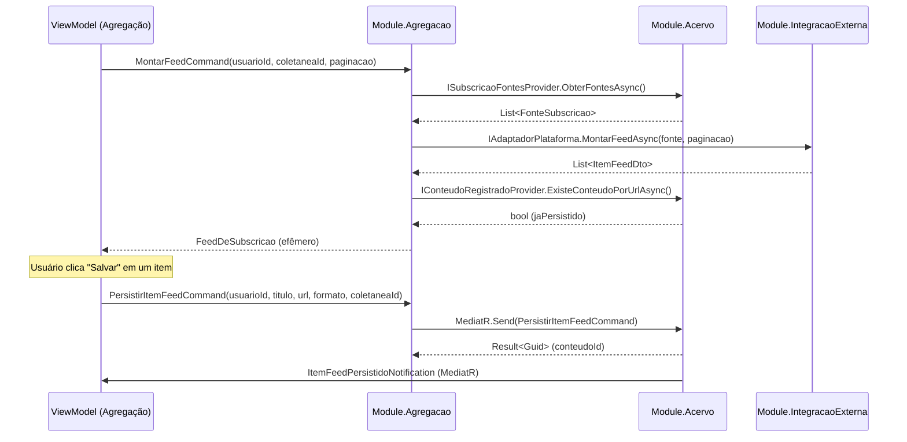

# Plan 3: Modelo Tático — BC Agregação

## Goal
Criar `docs/domain/agregacao.md` com o modelo tático do BC Agregação, documentando suas visões efêmeras, contratos, a ausência intencional de persistência própria, e o mapeamento dos Cenários 6 e 7 do Apêndice A.

## Context
O BC Agregação é o segundo contexto principal (Prioridade 2) — Pilar 2 do sistema. Sua característica central é que **não tem entidades persistidas próprias**: opera sobre visões efêmeras (`FeedDeSubscricao`, `AgregadorConsolidado`) e delega toda persistência ao BC Acervo via `PersistirItemFeedCommand`. A pesquisa (01-RESEARCH.md seção 1.2) identificou essa distinção como crítica para o design. Requisito ARQ-01 exige modelagem tática completa dos BCs core.

## Tasks

<task id="3.1" title="Criar docs/domain/agregacao.md — Modelo tático e contratos">
<read_first>
- `especificacoes/1  - definicao-de-dominio.md` — seções 5.2 (Agregador), Apêndice A Cenários 6 e 7
- `especificacoes/3 - mapa-de-contexto.md` — linguagem ubíqua do BC Agregação, relacionamento com Acervo e Integração Externa
- `.planning/phases/01-modelagem-t-tica-ddd/01-RESEARCH.md` — seção 1.2 (Agregação sem repositórios próprios), seção 1.3 (eventos e interfaces), seção 1.4 (BCs de suporte — IntegracaoExterna)
- `especificacoes/5 - technical-standards.md` — seção 6.2 e o padrão de visões efêmeras vs. agregados persistidos
</read_first>

<action>
Criar `docs/domain/agregacao.md` com o seguinte conteúdo. Preencha as seções com valores concretos extraídos dos documentos de especificação — não use placeholders genéricos.

**Estrutura do documento:**

```markdown
# BC Agregação — Modelo Tático

**Classificação:** Principal (Prioridade 2)
**Linguagem Ubíqua:** [extraída do Mapa de Contexto v1 — termos do BC Agregação]
**Projeto .NET:** `DiarioDeBordo.Module.Agregacao`
**Interfaces consumidas de:** `DiarioDeBordo.Core` (implementadas em `DiarioDeBordo.Module.Acervo` e `DiarioDeBordo.Module.IntegracaoExterna`)

---

## Característica central: sem persistência própria

O BC Agregação **não tem repositórios nem entidades persistidas próprias**. Toda a sua operação produz visões efêmeras — computadas em memória durante o ciclo de um request e descartadas depois.

A única escrita ao banco que o BC Agregação realiza é via delegação ao BC Acervo através do comando `PersistirItemFeedCommand`. Esse comando é enviado explicitamente por ação do usuário — o feed nunca persiste automaticamente.

Isso é uma decisão de domínio intencional: **um item de feed existe apenas enquanto o usuário o vê. Somente a interação explícita (salvar, marcar, anotar) transforma um item de feed em um registro do Acervo.**

---

## Conceitos do Domínio (Visões Efêmeras)

| Conceito | Natureza | Ciclo de vida |
|---|---|---|
| `FeedDeSubscricao` | Visão efêmera | Computada em memória por request; nunca persistida |
| `AgregadorConsolidado` | Visão efêmera | Consolidação de múltiplos FeedDeSubscricao; nunca persistida |
| `ItemFeedDto` | DTO imutável | Em memória durante o ciclo de request |
| `FiltroAgregador` | Value Object (parâmetro) | Entrada do request; não persistido |
| `EstadoOfflineSubscricao` | Value Object (indicador) | Calculado em runtime; não persistido |

---

## DTOs e Value Objects

```csharp
// Item de feed — imutável, efêmero:
public sealed record ItemFeedDto(
    string IdExterno,         // ID na plataforma de origem
    string Titulo,
    string? Descricao,
    string? UrlFonte,
    string? ThumbnailUrl,
    FormatoMidia Formato,
    string Plataforma,        // "youtube", "rss", "instagram"
    DateTimeOffset? PublicadoEm,
    bool JaPersistido         // true se já existe Conteudo no Acervo para este item
);

// Parâmetros de filtro do agregador:
public sealed record FiltroAgregador(
    Guid? FiltrarPorFonteId,
    bool EsconderConsumidos,
    IReadOnlyList<string> PalavrasChaveExcluir,
    OrdemAgregador Ordem     // CronologicoDecrescente (padrão), CronologicoAscrescente
);

// Indicador de estado offline de uma subscrição:
public sealed record EstadoOfflineSubscricao(
    Guid ColetaneaId,
    bool EstaOnline,
    int ItensCachedDisponiveisOffline
);
```

---

## Interfaces consumidas de outros BCs

Todas definidas em `DiarioDeBordo.Core`:

```csharp
// Implementada em Module.Acervo — lê fontes da coletânea Subscrição:
public interface ISubscricaoFontesProvider
{
    Task<IReadOnlyList<FonteSubscricao>> ObterFontesAsync(
        Guid usuarioId, Guid coletaneaSubscricaoId, CancellationToken ct);
}
public sealed record FonteSubscricao(Guid FonteId, string Tipo, string Valor, string? Plataforma);

// Implementada em Module.Acervo — verifica se um ItemFeed já foi persistido (deduplicação):
public interface IConteudoRegistradoProvider
{
    Task<bool> ExisteConteudoPorUrlAsync(Guid usuarioId, string urlNormalizada, CancellationToken ct);
    Task<bool> ExisteConteudoPorIdentificadorAsync(Guid usuarioId, string plataforma, string identificador, CancellationToken ct);
}

// Implementada em Module.IntegracaoExterna — busca itens de feed de plataformas externas:
public interface IAdaptadorPlataforma
{
    bool SuportaPlataforma(string tipo);
    Task<Result<IReadOnlyList<ItemFeedDto>>> MontarFeedAsync(
        FonteSubscricao fonte, PaginacaoParams paginacao, CancellationToken ct);
    Task<Result<MetadadosExternosDto?>> ObterMetadadosAsync(
        string urlOuIdentificador, string plataforma, CancellationToken ct);
}
```

---

## Command enviado ao BC Acervo

```csharp
// Definido em DiarioDeBordo.Core — BC Agregação envia, BC Acervo trata:
public sealed record PersistirItemFeedCommand(
    Guid UsuarioId,
    string Titulo,
    string? Descricao,
    string? UrlFonte,
    string? ThumbnailUrl,
    FormatoMidia Formato,
    Guid ColetaneaSubscricaoId
) : IRequest<Result<Guid>>;
// Retorna: Guid do Conteudo criado ou existente (deduplicação transparente)

// Quando publicado: APENAS por ação explícita do usuário (salvar, marcar, anotar item do feed)
// NUNCA automático — nenhum item persiste sem interação do usuário
```

---

## Invariantes do BC Agregação

| # | Invariante | Consequência |
|---|---|---|
| IA-01 | Nenhum item de feed persiste automaticamente | `PersistirItemFeedCommand` só é enviado por ação explícita do usuário no ViewModel |
| IA-02 | O feed é montado sob demanda — não é cacheado no banco | Toda navegação ao feed dispara `IAdaptadorPlataforma.MontarFeedAsync` |
| IA-03 | Sem scroll infinito — paginação obrigatória | `PaginacaoParams` obrigatório em toda consulta de feed |
| IA-04 | Sem métricas sociais (likes, views, comentários de terceiros) | `ItemFeedDto` não inclui campos de métricas sociais |
| IA-05 | Sem algoritmo de ranqueamento — ordem cronológica apenas | `FiltroAgregador.Ordem` aceita somente variações de ordem cronológica |
| IA-06 | Offline: exibir apenas itens com registro existente e sinalizar incompletude | `EstadoOfflineSubscricao.EstaOnline == false` → exibir apenas `ItemFeedDto` com `JaPersistido == true` |

---

## Fluxo: Montar Feed de Subscrição

```
Input: UsuarioId, ColetaneaSubscricaoId, PaginacaoParams

1. ISubscricaoFontesProvider.ObterFontesAsync(usuarioId, coletaneaId)
   → Lista de FonteSubscricao (tipos: rss, youtube, etc.)

2. Para cada FonteSubscricao:
   a. Encontrar IAdaptadorPlataforma que suporte fonte.Tipo
   b. IAdaptadorPlataforma.MontarFeedAsync(fonte, paginacao)
   → List<ItemFeedDto> (sem persistência)

3. Para cada ItemFeedDto retornado:
   a. IConteudoRegistradoProvider.ExisteConteudoPorUrlAsync(usuarioId, item.UrlFonte)
   b. Se existe: ItemFeedDto com JaPersistido = true
   c. Se não existe: ItemFeedDto com JaPersistido = false

4. Retornar FeedDeSubscricao (lista efêmera de ItemFeedDto com paginação)

Se IAdaptadorPlataforma lançar timeout/erro → EstadoOfflineSubscricao(EstaOnline=false)
→ Retornar apenas itens com JaPersistido=true + sinalizar no ViewModel
```

---

## Fluxo: Montar Agregador Consolidado

```
Input: UsuarioId, IReadOnlyList<ColetaneaSubscricaoId>, FiltroAgregador, PaginacaoParams

1. Executar fluxo "Montar Feed de Subscrição" para cada ColetaneaSubscricaoId
2. Consolidar todos os ItemFeedDto em uma lista única
3. Aplicar FiltroAgregador:
   a. FiltrarPorFonteId → filtrar por FonteSubscricao.FonteId
   b. EsconderConsumidos → remover ItemFeedDto onde Conteudo.Progresso.Estado == Concluido
   c. PalavrasChaveExcluir → remover ItemFeedDto onde Titulo ou Descricao contém palavra
4. Ordenar por PublicadoEm (FiltroAgregador.Ordem)
5. Paginar resultado (PaginatedList<T>)
6. Retornar AgregadorConsolidado (visão efêmera)
```

---

## Diagrama de colaboração (Mermaid)



---

## Cenários do Apêndice A cobertos

### Cenário 6: "Seguir criadores no YouTube e Instagram sem scroll infinito, sem likes, sem algoritmo"

**Caminho no modelo:**
1. Usuário cria `Conteudo` com `Papel = Coletanea`, `TipoColetanea = Subscricao` para cada criador
2. Adiciona `Fonte` com `Tipo = Url` (canal YouTube) ou `Tipo = Identificador` (@ do Instagram) à coletânea de subscrição
3. Agregador consolida todas as subscrições: executa fluxo "Montar Agregador Consolidado"
4. `IAdaptadorPlataforma` (implementado em Module.IntegracaoExterna) busca itens — sem métricas sociais no `ItemFeedDto` (invariante IA-04)
5. Paginação obrigatória via `PaginacaoParams` (invariante IA-03) — scroll infinito impossível por design
6. Filtro `EsconderConsumidos = true` disponível — usuário controla o que vê

**Lacuna condicional:** Instagram pode impedir obtenção de metadados → `IAdaptadorPlataforma.MontarFeedAsync` retorna `Result.Failure` com erro → ViewModel sinaliza "fonte indisponível" sem crash

**Entidades/interfaces envolvidas:** `FeedDeSubscricao`, `AgregadorConsolidado`, `ItemFeedDto`, `FiltroAgregador`, `IAdaptadorPlataforma`, `ISubscricaoFontesProvider`

### Cenário 7: "Primeiro uso do sistema sem internet"

**Caminho no modelo:**
1. Todas as subscrições têm feeds vazios — `IAdaptadorPlataforma.MontarFeedAsync` retorna erro de rede
2. `EstadoOfflineSubscricao(EstaOnline=false)` calculado para todas as subscrições
3. Agregador retorna apenas `ItemFeedDto` com `JaPersistido=true` (invariante IA-06) — vazio no primeiro uso
4. Sinalização visual de "feed indisponível offline" no ViewModel
5. Pilar 1 (Acervo) funciona integralmente — usuário pode criar conteúdos, organizar coletâneas Guiadas/Miscelânea

**Entidades/interfaces envolvidas:** `EstadoOfflineSubscricao`, `AgregadorConsolidado`, `FeedDeSubscricao`

---

## Mapeamento de Invariantes → Testes Futuros (Phase 6)

| Invariante | Método de teste previsto |
|---|---|
| IA-01: Sem persistência automática | `AgregacaoTests.ItemFeedSemInteracaoUsuario_NaoPersiste()` |
| IA-03: Paginação obrigatória | `AgregacaoTests.MontarFeedSemPaginacao_LancaException()` |
| IA-05: Sem ranqueamento | `AgregacaoTests.MontarFeed_OrdemSempreEhCronologica()` |
| IA-06: Comportamento offline | `AgregacaoTests.Offline_ExibeApenasItensPersistidos()` |
| Deduplicação transparente | `AgregacaoTests.PersistirItemFeedDuplicado_RetornaIdExistente()` |
```
</action>

<acceptance_criteria>
- [ ] `docs/domain/agregacao.md` existe
- [ ] `docs/domain/agregacao.md` contém "sem persistência própria"
- [ ] `docs/domain/agregacao.md` contém "PersistirItemFeedCommand"
- [ ] `docs/domain/agregacao.md` contém "ISubscricaoFontesProvider"
- [ ] `docs/domain/agregacao.md` contém "IConteudoRegistradoProvider"
- [ ] `docs/domain/agregacao.md` contém "IAdaptadorPlataforma"
- [ ] `docs/domain/agregacao.md` contém "FeedDeSubscricao"
- [ ] `docs/domain/agregacao.md` contém "AgregadorConsolidado"
- [ ] `docs/domain/agregacao.md` contém "ItemFeedDto"
- [ ] `docs/domain/agregacao.md` contém "EstadoOfflineSubscricao"
- [ ] `docs/domain/agregacao.md` contém "## Cenários do Apêndice A cobertos"
- [ ] `docs/domain/agregacao.md` contém "Cenário 6"
- [ ] `docs/domain/agregacao.md` contém "Cenário 7"
- [ ] `docs/domain/agregacao.md` contém "sequenceDiagram" (diagrama Mermaid)
- [ ] `docs/domain/agregacao.md` contém "## Mapeamento de Invariantes → Testes Futuros"
- [ ] `grep -c "| IA-" docs/domain/agregacao.md` retorna ≥ 6
- [ ] `wc -l docs/domain/agregacao.md` retorna valor ≥ 100
</acceptance_criteria>
</task>

## Verification
- [ ] `docs/domain/agregacao.md` existe e tem ≥ 100 linhas
- [ ] Os 2 cenários do Apêndice A (6 e 7) aparecem explicitamente com caminho no modelo
- [ ] A ausência intencional de repositórios está documentada com justificativa
- [ ] Fluxos "Montar Feed" e "Montar Agregador" estão descritos com algoritmo e interfaces envolvidas

## must_haves
- `docs/domain/agregacao.md` documenta que o BC Agregação não tem entidades persistidas próprias — com justificativa explícita
- Contratos C# completos: `PersistirItemFeedCommand`, `ISubscricaoFontesProvider`, `IConteudoRegistradoProvider`, `IAdaptadorPlataforma`
- Invariantes IA-01 a IA-06 documentadas (sem persistência automática, sem scroll infinito, sem ranqueamento, comportamento offline)
- Cenários 6 e 7 do Apêndice A percorridos com caminho explícito no modelo

## Output
After completion, create `.planning/phases/01-modelagem-t-tica-ddd/01-03-SUMMARY.md`
