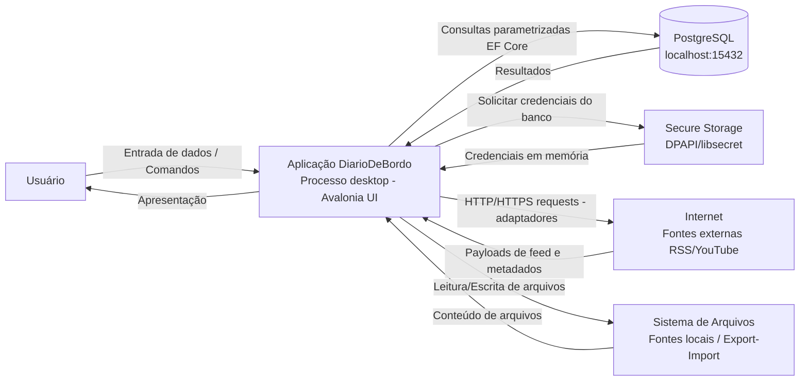
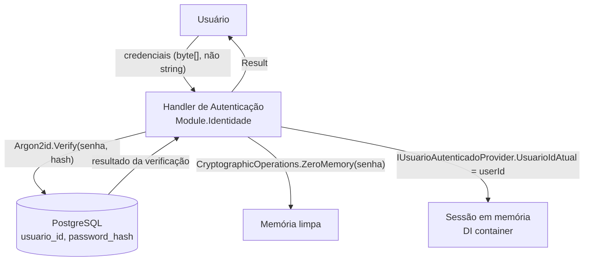
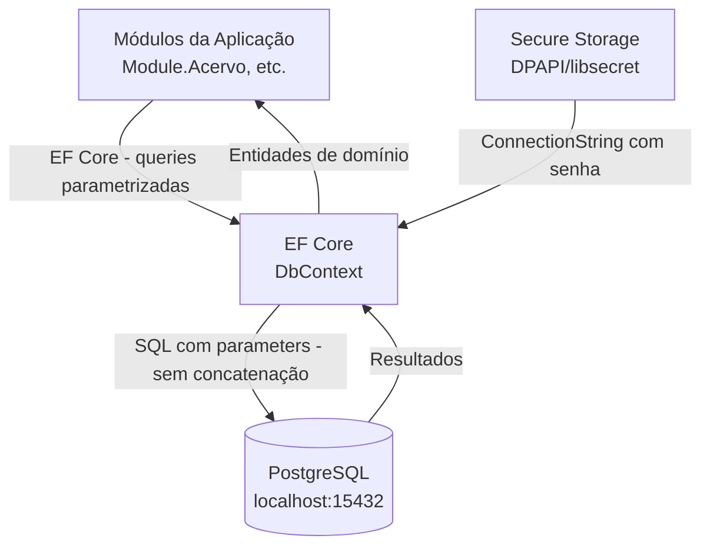
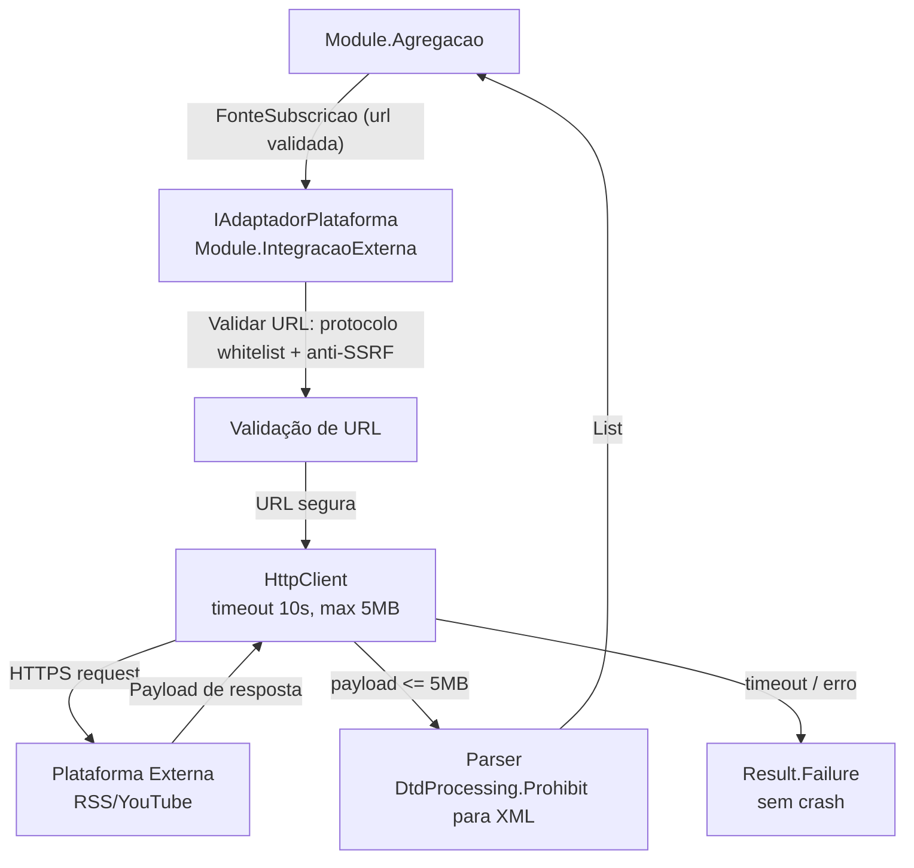
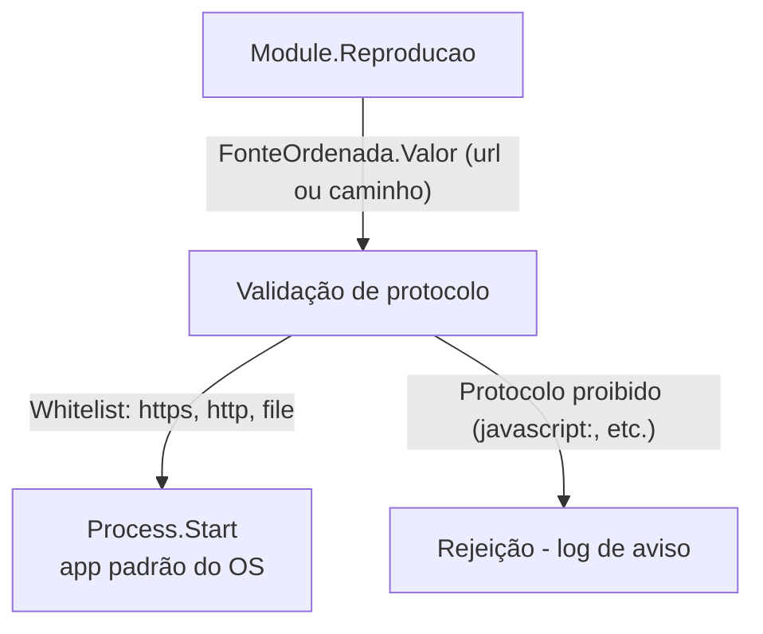
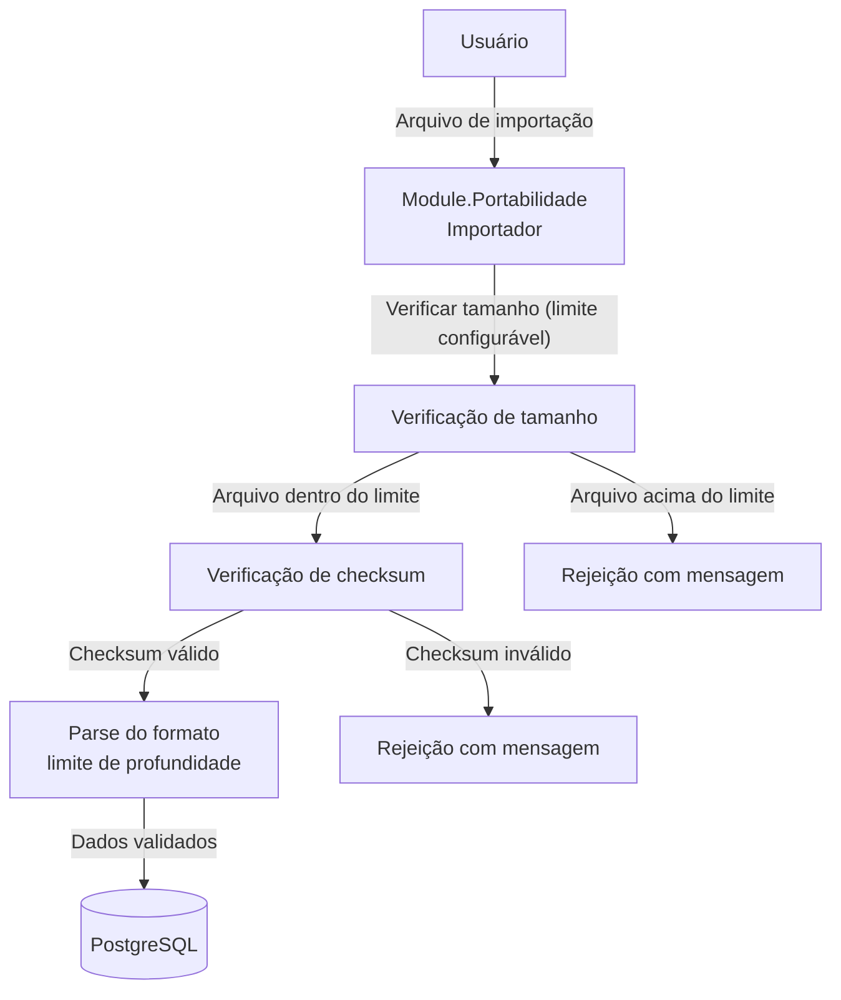

# Plan 5: Threat Model STRIDE — DFD e Tabela

## Goal
Criar os três documentos do threat model (`overview.md`, `dfd-nivel-1.md`, `stride-table.md`) com DFD nível 0 e 1 e tabela STRIDE expandida com mitigações rastreáveis — antes de qualquer código de rede ou persistência.

## Context
O requisito SEG-01 exige que o threat model seja criado antes da implementação das camadas de rede e persistência. O Padrões Técnicos v4 (Apêndice C) já tem um esboço STRIDE de alto nível — esta tarefa expande com DFD e mitigações concretas. A pesquisa (01-RESEARCH.md seção 3) identificou 15 ameaças específicas e 4 considerações de desktop app. Depende do Plano 01 (estrutura de diretórios) para que `docs/threat-model/` exista. Plano 04 pode rodar em paralelo (wave 2).

## Tasks

<task id="5.1" title="Criar docs/threat-model/overview.md — DFD nível 0 e resumo">
<read_first>
- `.planning/phases/01-modelagem-t-tica-ddd/01-RESEARCH.md` — seção 3.1 (superfícies de ataque, DFD nível 0 e 1), seção 3.3 (considerações de desktop app)
- `especificacoes/5 - technical-standards.md` — seção 4 (segurança) e Apêndice C (tabela STRIDE de alto nível existente)
- `docs/adr/ADR-005-seguranca.md` — decisões de segurança a referenciar nas mitigações
</read_first>

<action>
Criar `docs/threat-model/overview.md` com o seguinte conteúdo:

```markdown
# Threat Model — DiarioDeBordo

**Data:** 2026-04-02
**Versão:** 1.0
**Metodologia:** STRIDE (Spoofing, Tampering, Repudiation, Information Disclosure, Denial of Service, Elevation of Privilege)
**Status:** Criado antes de qualquer código de rede ou persistência — conforme SEG-01

## Propósito

Este documento é a referência base para análise de segurança do sistema DiarioDeBordo. Funciona como ponto de partida para o pentest full scope por milestone (Phase 11, requisito SEG-05).

Documentos complementares:
- `dfd-nivel-1.md` — DFDs detalhados por subsistema
- `stride-table.md` — Tabela STRIDE com todas as ameaças e mitigações rastreáveis

---

## Escopo do Sistema

**O que está no escopo:**
- Aplicação desktop nativa (Avalonia UI) rodando no processo do usuário
- PostgreSQL bundled rodando localmente na porta 15432
- Comunicação in-process via MediatR entre módulos
- Adaptadores HTTP/HTTPS para fontes externas (RSS, YouTube)
- DPAPI/libsecret para armazenamento de credenciais
- Sistema de arquivos local (fontes de arquivo, importação/exportação)

**O que está fora do escopo:**
- Infraestrutura de servidor (sistema é desktop-only)
- Autenticação OAuth/SSO (fora do design)
- Sincronização entre instâncias (fora do design)

---

## DFD Nível 0 — Sistema Completo

O diagrama abaixo representa o sistema em sua totalidade, com as principais entidades externas e fluxos de dados.



**5 superfícies de ataque identificadas:**

| Superfície | Vetor principal | Trust boundary |
|---|---|---|
| 1. Entrada do usuário | UI → Processo | Confiança total (usuário local) |
| 2. Banco de dados | Processo → PostgreSQL localhost:15432 | Processo da aplicação → processo do banco |
| 3. Secure Storage | OS → Processo | OS Keychain/DPAPI → aplicação |
| 4. Rede externa | Processo → Internet | Aplicação → plataformas externas |
| 5. Sistema de arquivos | Processo → FS | Processo → arquivos do usuário |

---

## Características de Segurança do Desktop App

Diferente de web apps, o vetor de ataque principal é **local**:

1. **PostgreSQL na porta 15432:** Outras aplicações no mesmo sistema podem tentar conectar. Mitigação: credenciais geradas na instalação, armazenadas no Secure Storage do OS — não em arquivos de configuração.

2. **Memória:** `CryptographicOperations.ZeroMemory()` após uso de dados sensíveis (senhas, chaves). Senhas em `byte[]`, nunca `string` (strings são imutáveis e podem ficar no GC após coleta).

3. **Binários:** Code signing via Velopack + verificação SHA-256 antes de instalar atualizações.

4. **Arquivos de exportação/importação:** Validar integridade (checksum + tamanho máximo) antes de processar. Rejeitar arquivos que excedam limite configurável.

---

## Referências

- Padrões Técnicos v4, seção 4 (segurança) e Apêndice C (STRIDE de alto nível)
- ADR-005: Abordagem de Segurança
- STRIDE methodology: Microsoft Threat Modeling Tool
```
</action>

<acceptance_criteria>
- [ ] `docs/threat-model/overview.md` existe e contém "STRIDE"
- [ ] `docs/threat-model/overview.md` contém "DFD Nível 0"
- [ ] `docs/threat-model/overview.md` contém "```mermaid"
- [ ] `docs/threat-model/overview.md` contém "15432"
- [ ] `docs/threat-model/overview.md` contém "DPAPI"
- [ ] `docs/threat-model/overview.md` contém "5 superfícies de ataque"
- [ ] `docs/threat-model/overview.md` contém "ZeroMemory"
- [ ] `docs/threat-model/overview.md` contém "SEG-01"
</acceptance_criteria>
</task>

<task id="5.2" title="Criar dfd-nivel-1.md e stride-table.md">
<read_first>
- `.planning/phases/01-modelagem-t-tica-ddd/01-RESEARCH.md` — seção 3.1 (tabela de subsistemas com entradas/saídas/trust boundaries), seção 3.2 (tabela STRIDE com 15 ameaças), seção 3.3 (considerações de desktop)
- `docs/threat-model/overview.md` — DFD nível 0 já criado (referência para nível 1)
- `especificacoes/5 - technical-standards.md` — seção 4.2 (adaptadores de rede) e seção 4.6 (usuarioId obrigatório)
</read_first>

<action>
Criar dois arquivos:

---

**`docs/threat-model/dfd-nivel-1.md`:**

```markdown
# DFD Nível 1 — Detalhamento por Subsistema

**Referência:** Veja `overview.md` para DFD nível 0 e escopo geral.

---

## Subsistema 1: Autenticação



**Trust boundary:** Processo da aplicação → processo do PostgreSQL (mesmo host, porta 15432)
**Entradas:** Credenciais do usuário (byte[])
**Saídas:** Token de sessão em memória (Guid do usuário)
**Dados sensíveis em trânsito:** Senha em memória — nunca serializada, zerada após uso

---

## Subsistema 2: Banco de Dados



**Trust boundary:** Processo da aplicação → PostgreSQL (localhost)
**Invariante de segurança:** Todo acesso inclui `WHERE usuario_id = @usuarioId` — sem exceções
**Proteções:**
- EF Core usa queries parametrizadas — BannedSymbols.txt proíbe concatenação de SQL
- ConnectionString nunca em arquivos de configuração — somente no Secure Storage do OS
- Porta 15432 (não-padrão) + credenciais fortes geradas na instalação

---

## Subsistema 3: Adaptadores de Rede



**Trust boundary:** Processo da aplicação → Internet (untrusted)
**Proteções obrigatórias (todas invioláveis):**
- `DtdProcessing.Prohibit` em todo XML/RSS — previne XXE
- Limite 5MB por payload — previne DoS por resposta gigante
- Timeout 10s — previne DoS por resposta lenta
- Validação pós-resolução DNS: rejeitar IPs privados (10.x, 192.168.x, 127.x) — previne SSRF
- Whitelist de protocolos: `https`, `http`, `file` apenas

---

## Subsistema 4: Reprodutor Externo



**Trust boundary:** Processo da aplicação → OS (Process.Start)
**Proteção:** Whitelist estrita de protocolos antes de qualquer `Process.Start`

---

## Subsistema 5: Importação de Arquivos



**Trust boundary:** Sistema de arquivos (potencialmente manipulado) → Processo da aplicação
**Proteções:** Verificação de tamanho antes do parse; checksum de integridade; limite de profundidade de nesting no JSON (JSON bomb prevention)
```

---

**`docs/threat-model/stride-table.md`:**

```markdown
# Tabela STRIDE — Ameaças e Mitigações

**Referência:** `overview.md` para escopo; `dfd-nivel-1.md` para DFDs por subsistema.
**Base:** Expandida do Apêndice C dos Padrões Técnicos v4.

## Tabela STRIDE

| ID | Categoria | Ameaça | DFD Relevante | Mitigação Específica | Status |
|---|---|---|---|---|---|
| T-01 | **S** Spoofing | Replay de sessão entre reinicializações | Autenticação | Token de sessão invalidado ao fechar a aplicação; sessão reinicia com autenticação | A definir em Phase 2 |
| T-02 | **S** Spoofing | Bypass de autenticação via manipulação de memória | Autenticação | Verificação em IUsuarioAutenticadoProvider na camada de serviço, não apenas na UI; sem autenticação apenas na camada de apresentação | A implementar em Phase 2 |
| T-03 | **T** Tampering | Injeção SQL via campo de busca ou filtro | Banco de Dados | EF Core com queries parametrizadas; BannedSymbols.txt proíbe string.Format ou concatenação em queries | A verificar em Phase 2 |
| T-04 | **T** Tampering | Arquivo de importação malicioso (JSON bomb, tamanho excessivo) | Importação | Verificação de tamanho antes do parse; limite de profundidade de nesting; checksum antes de processar | A implementar em Phase 10 |
| T-05 | **T** Tampering | XML externo com XXE (XML External Entity) | Adaptadores de Rede | `DtdProcessing.Prohibit` em todo parsing XML/RSS — sem exceção | A verificar em Phase 5 |
| T-06 | **T** Tampering | SSRF via URL de fonte externa | Adaptadores de Rede | Validação pós-resolução DNS: rejeitar IPs privados (10.x, 192.168.x, 127.x, 169.254.x); whitelist de protocolos | A implementar em Phase 5 |
| T-07 | **T** Tampering | Injeção de protocolo via `Process.Start` | Reprodutor Externo | Whitelist de protocolos (`https`, `http`, `file`) antes de qualquer Process.Start; rejeitar `javascript:`, `data:`, etc. | A implementar em Phase 8 |
| T-08 | **R** Repudiation | Negação de ação do usuário (ex: "não apaguei isso") | Banco de Dados | `HistoricoAcao` imutável por design (só append); logging auditável com timestamp e tipo de ação | A implementar em Phase 3 |
| T-09 | **I** Information Disclosure | Cross-user data leak — usuário A acessa dados de B | Banco de Dados | `WHERE usuario_id = @usuarioId` obrigatório em toda query; análise estática via BannedSymbols.txt para queries sem filtro de usuário | A verificar em Phase 2 |
| T-10 | **I** Information Disclosure | Credenciais do banco em plaintext (config files, logs) | Banco de Dados / Secure Storage | Credenciais somente no DPAPI (Windows) ou libsecret (Linux); sem appsettings.json com senhas; BannedSymbols.txt proíbe logging de credenciais | A verificar em Phase 2 |
| T-11 | **I** Information Disclosure | Dados sensíveis em logs | Todos | Regras de logging: sem senhas, tokens, PII em logs; review de logs em pentest | A verificar em Phase 2 |
| T-12 | **I** Information Disclosure | Admin area discovery por não-admins | UI + Service layer | Área admin inexistente para usuários sem role Admin em TODAS as camadas — UI não renderiza, service layer rejeita sem indicar que existe | A implementar em Phase 9 |
| T-13 | **D** Denial of Service | Payload RSS gigante bloqueia processo | Adaptadores de Rede | Limite 5MB por payload; timeout 10s; circuit breaker após N falhas consecutivas | A implementar em Phase 5 |
| T-14 | **D** Denial of Service | Consulta sem paginação retorna milhares de itens | Banco de Dados | `PaginatedList<T>` obrigatório — testes falham se retorno não for paginado; BannedSymbols.txt para métodos `.ToList()` sem paginação em queries de listagem | A verificar em Phase 2 |
| T-15 | **E** Elevation of Privilege | Consumidor acessa funcionalidades de admin | Service layer | RBAC verificado na camada de serviço (não apenas UI); IUsuarioAutenticadoProvider.RolesAtuais verificado antes de toda operação restrita | A implementar em Phase 9 |

---

## Rastreabilidade de Mitigações

| Mitigação técnica | Implementada por | Verificada por |
|---|---|---|
| EF Core queries parametrizadas | `DbContext` + BannedSymbols.txt | Análise estática em CI (Phase 2+) |
| `DtdProcessing.Prohibit` | `IAdaptadorPlataforma` | Testes de integração do adaptador RSS (Phase 5) |
| Anti-SSRF DNS validation | `IAdaptadorPlataforma` | Testes com URLs de IPs privados (Phase 5) |
| DPAPI/libsecret para credenciais | Módulo de configuração da aplicação | Pentest local (Phase 11) |
| `CryptographicOperations.ZeroMemory()` | Handlers de autenticação | Code review + pentest de memória (Phase 11) |
| BannedSymbols.txt | Arquivo de análise estática Roslyn | CI pipeline — build falha se violado (Phase 2) |
| `WHERE usuario_id = @usuarioId` | `IConteudoRepository` + todos os repositórios | Testes de isolamento entre usuários (Phase 2+) |
| Whitelist de protocolos (Process.Start) | Module.Reproducao | Testes com URLs maliciosas (Phase 8) |
| Limite 5MB + timeout 10s | `HttpClient` configurado em Module.IntegracaoExterna | Testes de carga/timeout (Phase 5) |

---

## Pentest checklist (Phase 11 — SEG-05)

Superfícies a cobrir no pentest full scope:
- [ ] Banco de dados local (PostgreSQL localhost:15432) — acesso por outras aplicações, SQLi
- [ ] Credenciais em memória — análise de heap dump
- [ ] Adaptadores de rede — SSRF, XXE, payloads maliciosos
- [ ] Importação de arquivos — JSON bomb, zip bomb, path traversal
- [ ] Process.Start — injeção de protocolo
- [ ] Cross-user data isolation — tentativa de acesso a dados de outro usuário
- [ ] Admin area — tentativa de acesso sem role Admin
```
</action>

<acceptance_criteria>
- [ ] `docs/threat-model/dfd-nivel-1.md` existe e contém "DFD Nível 1"
- [ ] `docs/threat-model/dfd-nivel-1.md` contém "DtdProcessing.Prohibit"
- [ ] `docs/threat-model/dfd-nivel-1.md` contém "SSRF"
- [ ] `docs/threat-model/dfd-nivel-1.md` contém "5MB"
- [ ] `docs/threat-model/dfd-nivel-1.md` contém "```mermaid"
- [ ] `docs/threat-model/dfd-nivel-1.md` contém "ZeroMemory"
- [ ] `docs/threat-model/stride-table.md` existe e contém "## Tabela STRIDE"
- [ ] `grep -c "| T-" docs/threat-model/stride-table.md` retorna ≥ 15
- [ ] `docs/threat-model/stride-table.md` contém "Spoofing"
- [ ] `docs/threat-model/stride-table.md` contém "Tampering"
- [ ] `docs/threat-model/stride-table.md` contém "Repudiation"
- [ ] `docs/threat-model/stride-table.md` contém "Information Disclosure"
- [ ] `docs/threat-model/stride-table.md` contém "Denial of Service"
- [ ] `docs/threat-model/stride-table.md` contém "Elevation of Privilege"
- [ ] `docs/threat-model/stride-table.md` contém "## Rastreabilidade de Mitigações"
- [ ] `docs/threat-model/stride-table.md` contém "## Pentest checklist"
</acceptance_criteria>
</task>

## Verification
- [ ] `ls docs/threat-model/*.md | wc -l` retorna `3`
- [ ] `grep -c "| T-" docs/threat-model/stride-table.md` retorna ≥ 15
- [ ] DFD nível 1 cobre os 5 subsistemas: Autenticação, Banco de Dados, Adaptadores de Rede, Reprodutor Externo, Importação
- [ ] Tabela STRIDE cobre todas as 6 categorias (S, T, R, I, D, E)
- [ ] `docs/threat-model/overview.md` contém diagrama Mermaid com as 5 superfícies de ataque

## must_haves
- Três documentos de threat model existem em `docs/threat-model/`
- DFD nível 0 em `overview.md` com diagrama Mermaid mostrando as 5 superfícies de ataque
- DFD nível 1 em `dfd-nivel-1.md` cobrindo 5 subsistemas com diagramas Mermaid, trust boundaries e proteções concretas
- Tabela STRIDE em `stride-table.md` com ≥ 15 ameaças (T-01 a T-15), todas as 6 categorias STRIDE, mitigações técnicas específicas e rastreabilidade para pentest futuro

## Output
After completion, create `.planning/phases/01-modelagem-t-tica-ddd/01-05-SUMMARY.md`
