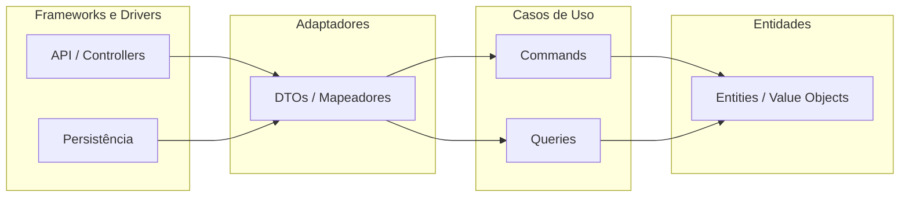
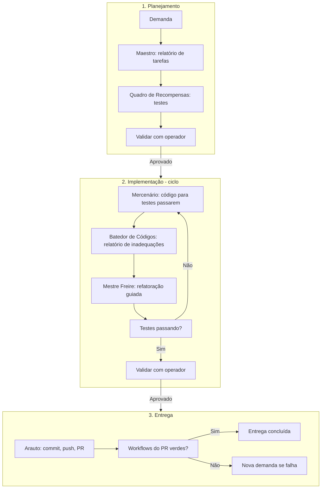

# Diário de Bordo

Sistema de acompanhamento de obras (manga, manhwa, anime, livro, filme, série).

[](https://dotnet.microsoft.com/download)
[](https://angular.io/)
[](https://blog.cleancoder.com/uncle-bob/2012/08/13/the-clean-architecture.html)
[](https://www.docker.com/)
[](.github/workflows/)
[](.github/workflows/)
[](.github/workflows/)
[](LICENSE)

Substitui o bloco de notas para acompanhar obras com posição atual, links de leitura/visualização, comentários por parte, datas e ordenação por preferência. Objetivo: listar obras, atualizar posição (com prévia), gerir situação e, opcionalmente, histórico e execução one-click com Docker.

---

## Arquitetura

O projeto segue **Clean Architecture** com camadas bem definidas e dependência sempre para dentro (Entidades ← Casos de Uso ← Adaptadores ← Frameworks/Drivers).



### Estrutura do projeto

```
DiarioDeBordo/
├── .github/                         # CI/CD (teste, build, deploy, secrets)
├── backend/                         # Backend .NET 9 (ver backend/README.md)
│   ├── DiarioDeBordo.sln
│   ├── README.md
│   └── src/
│       ├── DiarioDeBordo.Api/           # Apresentação (Controllers, Middlewares)
│       ├── DiarioDeBordo.Application/   # Casos de uso (Commands, Queries, Handlers, Validations)
│       ├── DiarioDeBordo.Domain/        # Domínio (Entities, Value Objects, Interfaces)
│       ├── DiarioDeBordo.Infrastructure/ # Serviços externos (email, arquivos, Flowpag, MFA)
│       ├── DiarioDeBordo.Persistence/   # DbContext, Migrations
│       └── DiarioDeBordo.Tests/         # Testes unitários e de integração
├── docker/                          # Docker Compose one-click (frontend local)
├── docs/                            # Documentação
├── frontend/                        # Angular 21 (on-premise na máquina do usuário)
├── guia                             # Guia de requisitos
├── README.md
├── scripts/                         # Scripts úteis (ex.: cobertura de testes)
└── LICENSE
```

- **Backend**: deploy **serverless** (AWS); consumido pela API.
- **Frontend**: execução **on-premise** na máquina do usuário (clone do repositório ou one-click Docker). Consome a API hospedada em ambiente serverless.

### Cobertura de testes

Para obter a porcentagem de cobertura de testes (backend e frontend), execute a partir da raiz do repositório:

```bash
./scripts/coverage.sh
```

As linhas finais exibem **Backend: X%** e **Frontend: Y%**. Relatórios detalhados ficam em `backend/TestResults` e `frontend/coverage/frontend/`.

Se o host não tiver Node 20+ (exigido pelo Angular CLI), execute os testes do frontend via Docker: `./scripts/frontend-test-docker.sh` (Node 22 + Chromium, mesmo ambiente do CI).

---

## Tecnologias e frameworks

| Área | Tecnologias |
|------|-------------|
| **Backend** | .NET 8, C# 12, ASP.NET Core, MediatR (CQRS), FluentValidation, Swagger/OpenAPI, xUnit, Moq, FluentAssertions, Coverlet |
| **Frontend** | Angular 21, Angular CLI |
| **Banco** | PostgreSQL ou SQL Server com Entity Framework Core 8; conexões TLS; LGPD (criptografia em repouso/trânsito, mínimo de dados) |
| **Infra** | Docker e Docker Compose para frontend local (one-click); backend serverless (AWS Lambda ou equivalente) |
| **CI/CD** | GitHub Actions (teste, build, gestão de secrets, deploy do backend) |
| **Autenticação** | JWT Bearer, MFA (autenticação de dois fatores) |
| **Pagamentos (PJ)** | Flowpag (ou gateway equivalente) para cobrança da coparticipação de 5% de PJ com faturamento > 500k/ano |

---

## Técnicas e regras do projeto

- **Clean Architecture**: camadas Entidades, Casos de Uso, Adaptadores, Frameworks/Drivers; dependência apenas para dentro.
- **CQRS**: comandos (alteram estado) e consultas (apenas leitura); nenhuma query altera estado.
- **DDD**: linguagem ubíqua (Obra, Parte, Situação, etc.), agregados, entidades, value objects, repositórios orientados ao domínio.
- **TDD**: testes antes do código; Red-Green-Refactor; testes unitários e de integração; FIRST e AAA.
- **Segurança e LGPD**: 2FA na autenticação; sem concatenação em SQL; minimização de dados; criptografia em repouso/trânsito e em campo para sensíveis; direitos do titular operacionalizáveis (acesso, correção, eliminação, portabilidade).
- **DevSecOps**: pipelines para teste, build, deploy e gestão de secrets; Git com PRs, mensagens explícitas e SemVer quando aplicável.
- **Metodologia rotina-completa**: planejamento (Maestro + Quadro de Recompensas), implementação em ciclos (Mercenário + Batedor de Códigos + Mestre Freire) e entrega (Arauto); ver seção [Metodologia de desenvolvimento](#metodologia-de-desenvolvimento-rotina-completa).

Detalhes nas regras em [.cursor/rules](.cursor/rules).

---

## Metodologia de desenvolvimento (rotina-completa)

O projeto adota uma **metodologia de trabalho para agentes de desenvolvimento** definida em regras e skills no diretório `.cursor/`. A rotina organiza demandas em três fases: **planejamento**, **implementação** (em ciclos até qualidade satisfatória) e **entrega**. Cada fase usa skills especializadas; a comunicação com o operador segue o tom de desenvolvedor em relação ao senior (orientação e validação).

### Fluxo da rotina-completa



### Fases e skills

| Fase | Skill | Papel |
|------|--------|--------|
| **1. Planejamento** | **Maestro** | Analisa a demanda e o código e produz relatório estruturado das alterações necessárias. |
| | **Quadro de Recompensas** | Cria testes automáticos (unitários, integração, E2E) a partir do relatório de tarefas. |
| **2. Implementação** | **Mercenário** | Implementa regras de negócio no código para que os testes passem e a demanda seja atendida. |
| | **Batedor de Códigos** | Analisa o código e produz relatório de inadequações (code smells, SOLID, Clean Architecture, DDD). |
| | **Mestre Freire** | Refatora conforme o relatório de inadequações, sem alterar comportamentos; testes continuam passando. |
| **3. Entrega** | **Arauto** | Commit descritivo, push, abertura de PR e validação dos workflows do PR; entrega só concluída com CI verde. |

Critério de parada na implementação: relatório do Batedor sem ajustes pendentes e operador satisfeito. Se alguma automação do PR falhar, abre-se nova demanda e executa-se nova rotina-completa para corrigir.

Regra e skills: [.cursor/rules/metodologia-para-devs.mdc](.cursor/rules/metodologia-para-devs.mdc) e [.cursor/skills/](.cursor/skills/).

---

## Funcionalidades e modos a implementar

### Mínimos

1. **Acompanhamento de obras** ✅ – listar obras paginadas (ordenadas por preferência), posição atual com rótulo por tipo, última atualização (relativa + tooltip `dd/MM/yyyy`), previsão de próxima parte. Backend (`GET /api/obras`) + Frontend Angular + Docker Compose implementados.
   - **Autenticação** ✅ – endpoint `POST /api/auth/login` com hash BCrypt, JWT e arquitetura 2FA-ready. Usuário admin criado automaticamente no seed. Frontend com módulo de login integrado à tela de Configurações (token salvo automaticamente). Ver seção "Como executar > Obter token de acesso".
2. **Atualizar posição** – por nome ou código da obra, parte atual, link opcional, comentários por parte, prévia antes de salvar; criar obra se não existir.
3. **Gestão de situação** – status (parado, em andamento, concluída, em hiato), comentário geral, sinopse, imagem de capa.

### Adicionais

4. **Extras** – imagem, nota 0–10, sinopse, data esperada de lançamento por origem.
5. **Comentários por posição/atualização**.
6. **Histórico** – datas de início, atualizações de posição e mudanças de situação.
7. **Execução one-click** – Docker em localhost para o frontend (estilo Penpot).

---

## Como executar

### Pré-requisitos

- .NET 8 SDK  
- Node.js 20.19+ ou 22+ (compatível com Angular 21)  
- Docker Desktop (recomendado para frontend one-click)  
- Banco de dados (ex.: PostgreSQL) conforme configuração do backend  

### Backend (desenvolvimento local)

O código e as instruções detalhadas de execução do backend estão em **[`backend/`](backend/)** — consulte o [`backend/README.md`](backend/README.md) para:
- estrutura de projetos e camadas,
- como configurar variáveis de ambiente (connection string, JWT),
- como rodar migrations e subir a API,
- fluxo de TDD para novas features.

Resumo rápido:

```bash
git clone <url-do-repositorio>
cd DiarioDeBordo/backend

# Configurar variáveis (nunca commitar credenciais)
export ConnectionStrings__DefaultConnection="Host=localhost;Database=diariodebordo;..."
export Jwt__Key="<chave-jwt-min-32-chars>"

dotnet restore
dotnet ef database update \
  --project src/DiarioDeBordo.Persistence \
  --startup-project src/DiarioDeBordo.Api
dotnet run --project src/DiarioDeBordo.Api
```

### Frontend (on-premise na máquina do usuário)

```bash
cd frontend
npm ci
npm start
```

**Configuração da URL da API:** a URL da API (backend serverless ou local) é configurada **em tela por um usuário administrador**: acesse o menu **Configurações** na aplicação e informe a URL do backend. O valor é armazenado localmente no navegador (localStorage). Não é definida por variável de ambiente no build.

### Obter token de acesso (pré-requisito para rotas protegidas)

As rotas protegidas (ex.: `GET /api/obras`) exigem um token JWT Bearer. Para obtê-lo:

**Via frontend:** acesse a tela **Configurações** e preencha o formulário de login com `admin` / `camaradinha@123`. O token é salvo automaticamente.

**Via curl:**

```bash
curl -X POST http://localhost:5000/api/auth/login \
  -H "Content-Type: application/json" \
  -d '{"login":"admin","senha":"camaradinha@123"}'
```

Copie o valor de `token` e configure-o em **Configurações > Token manual** no frontend.

### One-click (Docker – backend + frontend)

Sobe o backend (.NET 9) e o frontend (Angular 21) via Docker Compose, conectando ao PostgreSQL instalado na máquina hospedeira. Consulte **[`COMO_RODAR_BACK_E_FRONT.txt`](COMO_RODAR_BACK_E_FRONT.txt)** para o passo a passo completo.

```bash
# Diretório: docker/
docker compose up --build
```

Portas típicas: frontend 4200; API via URL do backend serverless. Após abrir a aplicação no browser, configure a URL da API em **Configurações** (admin).

### Migrations (EF Core)

Execute a partir do diretório `backend/`:

```bash
# Criar nova migration
dotnet ef migrations add NomeDaMigration \
  --project src/DiarioDeBordo.Persistence \
  --startup-project src/DiarioDeBordo.Api

# Aplicar migrations (usar connection string via variável de ambiente)
dotnet ef database update \
  --project src/DiarioDeBordo.Persistence \
  --startup-project src/DiarioDeBordo.Api
```

**Testes (frontend):** testes unitários com Karma/Jasmine (`npm run test`), cobertura com `npm run test:coverage`; testes e2e com Playwright (`npm run e2e`). O pipeline em [.github/workflows/frontend-ci.yml](.github/workflows/frontend-ci.yml) executa lint, testes unitários, build e e2e (job e2e não bloqueante no primeiro PR).

**Testes (backend):** `dotnet test` a partir de `backend/`. Ver [`backend/README.md`](backend/README.md).

Nunca incluir credenciais no repositório; usar variáveis de ambiente ou GitHub Secrets no pipeline.

---

## Deploy: backend serverless e frontend on-premise

### Backend (AWS serverless)

O backend é implantado como **serverless** na AWS (ex.: AWS Lambda + API Gateway para a API .NET, ou container serverless).

- **Pipeline**: trigger em push na branch `main` (ou conforme definido em [.github/workflows](.github/workflows)).
- **Build e publicação**: testes, build e publicação da função/container via GitHub Actions.
- **Configuração**: variáveis de ambiente e secrets (GitHub Secrets) para connection string, JWT, Flowpag, etc.
- **Health check**: endpoint de saúde da API para validação pós-deploy.

Referência a EC2 apenas se for usada para runners ou serviços auxiliares; o núcleo da API é serverless.

### Frontend (on-premise)

O frontend **não** é deployado na nuvem; roda **on-premise** na máquina do usuário.

- **Obtenção**: clone do repositório ou pacote/instalador, se disponível.
- **Configuração**: definir a URL da API (backend serverless) em variável de ambiente ou arquivo de configuração.
- **Execução**: `npm start` / `ng serve` ou one-click com Docker em localhost.

### Flowpag

Integração com **Flowpag** (ou gateway equivalente) para cobrança da **coparticipação de 5%** para pessoas jurídicas com faturamento superior a 500.000 reais por ano (detalhes em [LICENSE](LICENSE)).

### MFA

Autenticação com **MFA** (autenticação de dois fatores): login, 2FA e tokens documentados na seção de autenticação da API (Swagger/endpoints).

---

## Banco de dados

### Modelo conceitual (alto nível)

- **Obra** – obra (manga, anime, livro, filme, série, etc.).
- **Posição (Parte)** – capítulo/episódio/parte em que parou; data da última consumida; tempo esperado até próxima.
- **Comentário** – comentários por parte ou gerais sobre a obra.
- **Situação** – status (parado, em andamento, concluída, em hiato).
- **Origem/Link** – links de onde a obra é acompanhada.

Relacionamentos: uma obra possui N posições/comentários/origens; situação associada à obra.

### Conformidade

- Conexão com TLS.  
- Criptografia em repouso.  
- Dados que identifiquem o usuário em conformidade com LGPD (minimização, finalidade, direitos do titular: acesso, correção, eliminação, portabilidade).

---

## Licença

- **Pessoas físicas**: uso livre.
- **Pessoas jurídicas**: uso livre; se o **faturamento ou ganhos forem superiores a 500.000 (quinhentos mil) reais por ano**, é devida **coparticipação de 5%** sobre ganhos relacionados ao uso do software.

Detalhes no arquivo [LICENSE](LICENSE).
