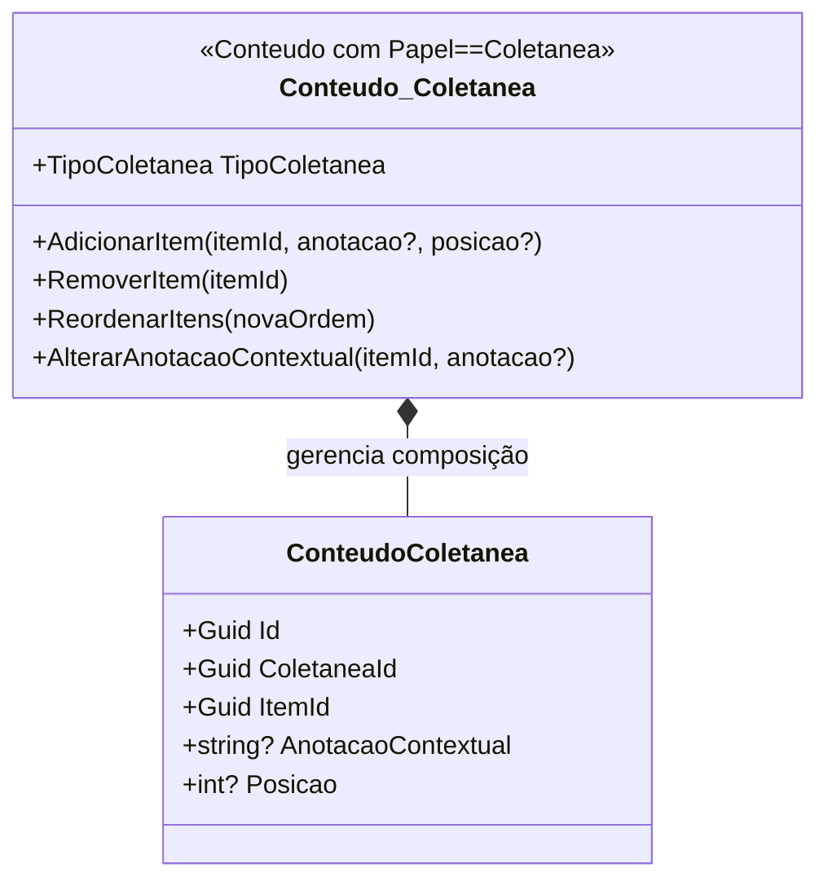

# BC Acervo — Modelo Tático

**Classificação:** Principal (Prioridade 1)
**Projeto .NET:** `DiarioDeBordo.Module.Acervo`
**Interfaces publicadas em:** `DiarioDeBordo.Core`
**Última atualização:** Phase 01 — Modelagem Tática DDD

---

## Linguagem Ubíqua

Termos extraídos do Mapa de Contexto v1, seção 1.1.

| Termo | Definição dentro do BC Acervo |
|---|---|
| **Conteúdo** | Qualquer coisa sobre a qual o usuário registra informações — digital ou físico, online ou offline. |
| **Formato de mídia** | Natureza material do conteúdo: áudio, texto, vídeo, imagem, interativo, misto, nenhum. |
| **Papel estrutural** | Função do conteúdo: `Item` (folha) ou `Coletanea` (nó que agrupa outros conteúdos). |
| **Coletânea** | Conteúdo com `Papel == Coletanea`, com tipo (guiada, miscelânea, subscrição) e configurações comportamentais. |
| **Progresso** | Estado global de consumo de um conteúdo — NaoIniciado, EmAndamento, Concluido. |
| **Categoria** | Tag livre atribuída pelo usuário; case-insensitive, única por usuário. |
| **Relação** | Vínculo bidirecional entre dois conteúdos com tipo textual (ex: "sequência de", "baseado em"). |
| **Anotação contextual** | Anotação específica da relação conteúdo-coletânea (distinta da anotação global no conteúdo). |
| **Fonte** | Origem de um conteúdo com prioridade de fallback (arquivo local, URL, RSS, identificador). |
| **Gancho** | Marcação em parte específica de um conteúdo (bookmark de posição + anotação). |
| **Deduplicação** | Garantia de que o mesmo conteúdo (por URL ou identificador de plataforma) não é registrado mais de uma vez por usuário. |
| **Hierarquia de autoridade** | Manual > Automático de fonte > Automático de metadados externos. |
| **Persistência seletiva** | Apenas itens de feed com interação do usuário geram registros no Acervo. |

---

## Agregados

O BC Acervo possui três agregados: **Conteudo**, **Coletanea** e **Categoria**.

> **Nota:** `Coletanea` é implementada como um `Conteudo` com `Papel == Coletanea` — mesma entidade base, papel diferente. Não existe uma classe `Coletanea` separada. A distinção táctica existe para separar responsabilidades e invariantes.

---

### Conteudo (Aggregate Root)

**Responsabilidade:** Proteger a consistência dos dados de um item do acervo — seus metadados, fontes, progresso, histórico de ações, imagens e ganchos.

#### Entidades

| Nome | Atributos | Papel dentro do agregado |
|---|---|---|
| `Conteudo` (AR) | `Id: Guid`; `Titulo: string` (obrigatório); `Descricao: string?`; `Anotacoes: string?`; `Nota: decimal? [0,10]`; `Classificacao: enum?`; `Formato: FormatoMidia`; `Subtipo: string?`; `Papel: PapelConteudo {Item, Coletanea}`; `TipoColetanea: TipoColetanea? {Guiada, Miscelanea, Subscricao}`; `UsuarioId: Guid`; `CriadoEm: DateTimeOffset`; `AtualizadoEm: DateTimeOffset` | Aggregate Root |
| `Fonte` | `Id: Guid`; `ConteudoId: Guid`; `Tipo: TipoFonte {Url, ArquivoLocal, Rss, Identificador}`; `Valor: string`; `Plataforma: string?`; `Prioridade: int` (único por conteúdo) | Entidade filha — ciclo de vida dependente |
| `HistoricoAcao` | `Id: Guid`; `ConteudoId: Guid`; `TipoAcao: TipoAcaoConteudo`; `Detalhe: string?`; `OcorridoEm: DateTimeOffset` | Imutável após criação; apenas o próprio `Conteudo` cria |
| `ImagemConteudo` | `Id: Guid`; `ConteudoId: Guid`; `OrigemTipo: OrigemImagem {Manual, Automatica}`; `Caminho: string`; `Principal: bool` | Máx. 20 por conteúdo; máx. 10 MB por imagem |
| `Gancho` | `Id: Guid`; `ConteudoId: Guid`; `Posicao: string`; `Anotacao: string?` | Relacionado ao conteúdo específico |

#### Value Objects

| Nome | Campos | Invariante |
|---|---|---|
| `Progresso` | `Estado: EstadoProgresso {NaoIniciado, EmAndamento, Concluido}`; `PosicaoAtual: string?`; `HistoricoConsumo: List<RegistroConsumo>`; `NotaManual: string?` | Estado é global ao conteúdo — compartilhado entre coletâneas |
| `RegistroConsumo` | `Data: DateOnly`; `PorcentagemConsumida: decimal?` | Imutável após criação |

#### Invariantes

| # | Invariante | Violação produz |
|---|---|---|
| I-01 | `Titulo` nunca nulo ou vazio | `DomainException("Título é obrigatório")` |
| I-02 | `TipoColetanea` nulo quando `Papel == Item`; obrigatório quando `Papel == Coletanea` | `DomainException("TipoColetanea obrigatório para Coletânea")` |
| I-03 | `Nota` no intervalo [0, 10] quando presente | `DomainException("Nota deve estar entre 0 e 10")` |
| I-04 | Máximo 20 imagens por conteúdo | `DomainException("Limite de 20 imagens atingido")` |
| I-05 | Máximo 10 MB por imagem | `DomainException("Imagem excede 10MB")` |
| I-06 | Apenas uma `ImagemConteudo` com `Principal == true` quando houver ≥ 1 imagem | `DomainException("Apenas uma imagem pode ser principal")` |
| I-07 | `Fonte.Prioridade` única por conteúdo — sem duas fontes com mesma prioridade | `DomainException("Prioridade já utilizada por outra fonte")` |

#### Operações do Aggregate Root

```
Conteudo.AlterarProgresso(estado: EstadoProgresso, posicao: string?)
  → Atualiza Progresso; publica ProgressoAlteradoNotification

Conteudo.AdicionarFonte(tipo: TipoFonte, valor: string, prioridade: int, plataforma: string?)
  → Verifica I-07; cria Fonte; registra HistoricoAcao.FonteAdicionada

Conteudo.AdicionarImagem(caminho: string, origem: OrigemImagem)
  → Verifica I-04, I-05; cria ImagemConteudo (Principal=false se não é a primeira)

Conteudo.DefinirImagemPrincipal(imagemId: Guid)
  → Verifica I-06; desmarca Principal nas demais; marca na selecionada

Conteudo.AdicionarGancho(posicao: string, anotacao: string?)
  → Cria Gancho; registra HistoricoAcao.GanchoAdicionado
```

#### Eventos de Domínio Publicados

| Evento | Quando publicado | Handlers esperados |
|---|---|---|
| `ConteudoCriadoNotification(ConteudoId, Titulo, UsuarioId)` | Após persistência de novo `Conteudo` | ViewModels de listagem que precisam atualizar |
| `ProgressoAlteradoNotification(ConteudoId, Estado, PosicaoAtual)` | Quando `Progresso.Estado` ou `PosicaoAtual` muda | `Module.Reproducao` (UI de reprodução), ViewModels |
| `ItemFeedPersistidoNotification(ConteudoId, Titulo)` | Após handler de `PersistirItemFeedCommand` | ViewModels do Acervo que monitoram novas chegadas |

```csharp
public sealed record ConteudoCriadoNotification(
    Guid ConteudoId, string Titulo, Guid UsuarioId) : INotification;

public sealed record ProgressoAlteradoNotification(
    Guid ConteudoId, EstadoProgresso Estado, string? PosicaoAtual) : INotification;

public sealed record ItemFeedPersistidoNotification(
    Guid ConteudoId, string Titulo) : INotification;
```

#### Repositório

```csharp
// Definido em DiarioDeBordo.Core — implementado em DiarioDeBordo.Module.Acervo.Infrastructure
public interface IConteudoRepository
{
    Task AdicionarAsync(Conteudo conteudo, CancellationToken ct);
    Task<Conteudo?> ObterPorIdAsync(Guid id, Guid usuarioId, CancellationToken ct);
    Task AtualizarAsync(Conteudo conteudo, CancellationToken ct);
    Task RemoverAsync(Guid id, Guid usuarioId, CancellationToken ct);
    Task<Conteudo?> BuscarPorUrlFonteAsync(Guid usuarioId, string urlNormalizada, CancellationToken ct);
    Task<Conteudo?> BuscarPorIdentificadorFonteAsync(Guid usuarioId, string plataforma, string identificador, CancellationToken ct);
}
// REGRA: todo método inclui usuarioId — sem exceções (Padrões Técnicos v4, seção 4.6)
```

#### Diagrama Mermaid

```mermaid
classDiagram
    class Conteudo {
        +Guid Id
        +string Titulo
        +string? Descricao
        +string? Anotacoes
        +decimal? Nota
        +FormatoMidia Formato
        +PapelConteudo Papel
        +TipoColetanea? TipoColetanea
        +Guid UsuarioId
        +Progresso Progresso
        +AlterarProgresso(estado, posicao)
        +AdicionarFonte(tipo, valor, prioridade)
        +AdicionarImagem(caminho, origem)
        +DefinirImagemPrincipal(imagemId)
        +AdicionarGancho(posicao, anotacao)
    }
    class Fonte {
        +Guid Id
        +TipoFonte Tipo
        +string Valor
        +int Prioridade
        +string? Plataforma
    }
    class HistoricoAcao {
        +Guid Id
        +TipoAcaoConteudo TipoAcao
        +string? Detalhe
        +DateTimeOffset OcorridoEm
    }
    class ImagemConteudo {
        +Guid Id
        +OrigemImagem OrigemTipo
        +string Caminho
        +bool Principal
    }
    class Gancho {
        +Guid Id
        +string Posicao
        +string? Anotacao
    }
    class Progresso {
        +EstadoProgresso Estado
        +string? PosicaoAtual
        +string? NotaManual
        +List~RegistroConsumo~ HistoricoConsumo
    }
    class RegistroConsumo {
        +DateOnly Data
        +decimal? PorcentagemConsumida
    }
    Conteudo *-- Fonte : contém (0..N, I-07 prioridade única)
    Conteudo *-- HistoricoAcao : contém (imutável)
    Conteudo *-- ImagemConteudo : contém (0..20 max, I-04/I-05/I-06)
    Conteudo *-- Gancho : contém
    Conteudo *-- Progresso : possui (1:1)
    Progresso *-- RegistroConsumo : histórico
```

---

### Coletanea (Aggregate Root)

**Responsabilidade:** Gerenciar a composição de itens em uma coletânea — ordem (Guiadas), anotações contextuais nas relações, e prevenção de ciclos em composições de coletâneas.

**Nota:** `Coletanea` é um `Conteudo` com `Papel == Coletanea`. Não há classe separada — a distinção é de responsabilidade.

#### Entidades adicionais (além das de Conteudo)

| Nome | Atributos | Papel dentro do agregado |
|---|---|---|
| `ConteudoColetanea` | `Id: Guid`; `ColetaneaId: Guid`; `ItemId: Guid`; `AnotacaoContextual: string?`; `Posicao: int?` (apenas Guiadas) | Pertence ao ciclo de vida da coletânea — gerenciada por ela |

#### Value Objects adicionais

| Nome | Campos | Invariante |
|---|---|---|
| `OrdemItem` | `Posicao: int` | Apenas para Guiadas; posições únicas e sem lacunas (1, 2, 3…) |

#### Invariantes adicionais

| # | Invariante | Violação produz |
|---|---|---|
| I-08 | Uma Coletânea não pode conter a si mesma, direta ou transitivamente | `DomainException("Operação criaria ciclo na composição")` — verificado via DFS antes da adição |
| I-09 | Coletânea Guiada: posições dos itens são únicas, sem lacunas (1, 2, 3…) | `DomainException("Posição duplicada ou com lacuna")` |
| I-10 | `TipoColetanea` é imutável após criação | `DomainException("TipoColetanea não pode ser alterado após criação")` |

#### Algoritmo de Detecção de Ciclos (DFS)

Executado toda vez que um item coletânea é adicionado como filho de outra coletânea.

```
AdicionarItem(coletaneaId: Guid, itemId: Guid, anotacao?: string, posicao?: int):
  Se Conteudo[itemId].Papel == Coletanea:
    descendentes ← IColetaneaRepository.ObterDescendentesAsync(itemId, usuarioId)
    Se coletaneaId ∈ descendentes → CICLO → lançar DomainException(I-08)
  Adicionar ConteudoColetanea(ColetaneaId=coletaneaId, ItemId=itemId, ...)
  Se TipoColetanea == Guiada: verificar I-09 (posição única e sem lacuna)

Complexidade: O(V+E) — linear no número de coletâneas e relações existentes
Referência: Tarjan (1972), SIAM J. on Computing
```

#### Operações do Aggregate Root (Coletanea)

```
Coletanea.AdicionarItem(itemId, anotacaoContextual?, posicao?)
  → Verifica I-08 (DFS anti-ciclo) se item é coletânea
  → Verifica I-09 se Guiada
  → Cria ConteudoColetanea

Coletanea.RemoverItem(itemId)
  → Remove ConteudoColetanea; reordena posições se Guiada (sem lacunas)

Coletanea.ReordenarItens(novaOrdem: List<Guid>)
  → Verifica I-09; reatribui posições 1…N sem lacunas

Coletanea.AlterarAnotacaoContextual(itemId, anotacao?)
  → Atualiza AnotacaoContextual na ConteudoColetanea correspondente
```

#### Repositório

```csharp
// Definido em DiarioDeBordo.Core — implementado em DiarioDeBordo.Module.Acervo.Infrastructure
public interface IColetaneaRepository
{
    Task AdicionarAsync(Conteudo coletanea, CancellationToken ct);
    Task<Conteudo?> ObterPorIdAsync(Guid id, Guid usuarioId, CancellationToken ct);
    Task<IReadOnlyList<Guid>> ObterDescendentesAsync(Guid coletaneaId, Guid usuarioId, CancellationToken ct);
    // ObterDescendentesAsync é usado pelo handler de AdicionarItem para verificação de ciclo (I-08)
    Task AtualizarAsync(Conteudo coletanea, CancellationToken ct);
}
```

#### Diagrama Mermaid



---

### Categoria (Aggregate Root)

**Responsabilidade:** Manter unicidade case-insensitive de categorias por usuário; fornecer autocompletar eficiente.

#### Entidade

| Nome | Atributos | Invariante |
|---|---|---|
| `Categoria` | `Id: Guid`; `UsuarioId: Guid`; `Nome: string`; `NomeNormalizado: string` (lowercase) | `NomeNormalizado` único por `UsuarioId` — impede duplicações case-insensitive |

#### Invariantes adicionais

| # | Invariante | Violação produz |
|---|---|---|
| I-11 | `Nome` nunca nulo ou vazio | `DomainException("Nome de categoria é obrigatório")` |
| I-12 | `NomeNormalizado` único por `UsuarioId` (case-insensitive) — "Romance" e "romance" são a mesma categoria | Tratado em `ObterOuCriarAsync` — retorna o existente em vez de criar duplicata |

#### Repositório

```csharp
// Definido em DiarioDeBordo.Core — implementado em DiarioDeBordo.Module.Acervo.Infrastructure
public interface ICategoriaRepository
{
    Task<Categoria> ObterOuCriarAsync(Guid usuarioId, string nome, CancellationToken ct);
    // ObterOuCriarAsync é atômico — garante que "Romance" e "romance" são o mesmo registro
    Task<IReadOnlyList<Categoria>> ListarComAutocompletarAsync(Guid usuarioId, string prefixo, CancellationToken ct);
    // prefixo é comparado contra NomeNormalizado (lowercase)
}
```

---

## Entidades fora dos Agregados (referenciadas por ID)

| Entidade | Justificativa | Gerenciada por |
|---|---|---|
| `RelacaoConteudo` | Bidirecionalidade exige gerenciamento fora dos dois agregados envolvidos | Application service (cria as duas direções em uma transação) |
| `ConteudoCategoria` | Tabela de junção — acesso via consulta, não via agregado | Application service |

---

## Interfaces Publicadas para Outros BCs

Definidas em `DiarioDeBordo.Core` — implementadas em `DiarioDeBordo.Module.Acervo`:

```csharp
// Consumida por Module.Agregacao — lê fontes da coletânea Subscrição:
public interface ISubscricaoFontesProvider
{
    Task<IReadOnlyList<FonteSubscricao>> ObterFontesAsync(
        Guid usuarioId, Guid coletaneaSubscricaoId, CancellationToken ct);
}

public sealed record FonteSubscricao(
    Guid FonteId,
    string Tipo,        // "rss", "youtube", "identificador"
    string Valor,       // URL do feed, URL do canal, @ do criador
    string? Plataforma  // "youtube", "rss", etc.
);

// Consumida por Module.Agregacao — verifica deduplicação antes de persistir:
public interface IConteudoRegistradoProvider
{
    Task<bool> ExisteConteudoPorUrlAsync(Guid usuarioId, string urlNormalizada, CancellationToken ct);
    Task<bool> ExisteConteudoPorIdentificadorAsync(Guid usuarioId, string plataforma, string identificador, CancellationToken ct);
}

// Consumida por Module.Reproducao:
public interface IConteudoParaReproducaoProvider
{
    Task<ConteudoReproducaoDto?> ObterAsync(Guid id, Guid usuarioId, CancellationToken ct);
}

public sealed record ConteudoReproducaoDto(
    Guid Id,
    string Titulo,
    FormatoMidia Formato,
    IReadOnlyList<FonteOrdenada> FontesOrdenadas,
    IReadOnlyList<GanchoDto> Ganchos
);

// Consumida por Module.Portabilidade:
public interface IDadosExportaveisProvider
{
    Task<ExportacaoDto> ExportarAsync(Guid usuarioId, CancellationToken ct);
}
```

---

## Commands e Handlers do BC Acervo

### PersistirItemFeedCommand

Enviado por `Module.Agregacao`; handler implementado em `Module.Acervo`:

```csharp
// Definido em DiarioDeBordo.Core
public sealed record PersistirItemFeedCommand(
    Guid UsuarioId,
    string Titulo,
    string? Descricao,
    string? UrlFonte,
    string? ThumbnailUrl,
    FormatoMidia Formato,
    Guid ColetaneaSubscricaoId
) : IRequest<Result<Guid>>;
```

**Invariantes do handler:**
1. Verificar deduplicação por `UrlFonte` (via `IConteudoRegistradoProvider.ExisteConteudoPorUrlAsync`) antes de criar.
2. Se duplicata: associar à coletânea via `ConteudoColetanea` e retornar o `Id` existente.
3. Se novo: criar `Conteudo` com dados do command (`Formato`, `Titulo`, `Descricao`); adicionar `Fonte` com `UrlFonte` se presente.
4. Registrar `HistoricoAcao` com `TipoAcao.CriadoPorFeed` no novo conteúdo.
5. Adicionar `ConteudoColetanea` apontando para a `ColetaneaSubscricaoId`.
6. Retornar `Result<Guid>` — nunca lançar exceção para fluxos de negócio esperados.
7. Após persistência bem-sucedida: publicar `ItemFeedPersistidoNotification(conteudoId, titulo)`.

---

## Cenários do Apêndice A cobertos

Todos os 5 cenários offline do Apêndice A da Definição de Domínio v3 são percorridos explicitamente abaixo com o caminho no modelo.

---

### Cenário 1: "Crio listas de filmes temáticas e anoto 'esse não achei dublado' e 'assistir em dia chuvoso'"

**Caminho no modelo:**
1. Usuário cria `Conteudo` com `Formato = Video`, `Subtipo = "filme"`, preenchendo `Titulo` (obrigatório, I-01) e `Anotacoes = "não achei dublado"` (campo global de texto livre).
2. Usuário cria `Conteudo` com `Papel = Coletanea`, `TipoColetanea = Miscelanea` — a lista temática (ex.: "Filmes de Chuva").
3. `Coletanea.AdicionarItem(filmeId, anotacaoContextual: "assistir em dia chuvoso")` → cria `ConteudoColetanea` com `AnotacaoContextual = "assistir em dia chuvoso"`.
4. A anotação "não achei dublado" fica em `Conteudo.Anotacoes` (global — aparece em todas as coletâneas em que o filme está); "assistir em dia chuvoso" fica em `ConteudoColetanea.AnotacaoContextual` (específica desta relação com esta lista).

**Entidades envolvidas:** `Conteudo`, `Conteudo_Coletanea` (Papel=Coletanea, TipoColetanea=Miscelanea), `ConteudoColetanea.AnotacaoContextual`
**Invariantes verificadas:** I-01 (Titulo obrigatório), I-02 (TipoColetanea obrigatório para Coletânea)
**Sem ambiguidade:** Distinção clara entre anotação global (no conteúdo) e contextual (na relação coletânea-item) está resolvida no modelo.

---

### Cenário 2: "Comprei CDs físicos e crio playlists com músicas de diversos CDs, com fallback para Spotify ou YouTube"

**Caminho no modelo:**
1. Cada música: `Conteudo` com `Formato = Audio`, `Subtipo = "musica"`, `Titulo` preenchido (I-01).
2. `Conteudo.AdicionarFonte(tipo: ArquivoLocal, valor: "/path/album/musica.mp3", prioridade: 1)` — arquivo local tem prioridade máxima.
3. `Conteudo.AdicionarFonte(tipo: Url, valor: "spotify://track/...", prioridade: 2)` — fallback Spotify.
4. `Conteudo.AdicionarFonte(tipo: Url, valor: "https://youtube.com/watch?v=...", prioridade: 3)` — fallback YouTube.
5. Invariante I-07 garante que as prioridades 1, 2 e 3 são únicas por conteúdo.
6. Playlist: `Conteudo` com `Papel = Coletanea`, `TipoColetanea = Miscelanea`.
7. `Coletanea.AdicionarItem(musicaId)` para cada música — sem verificação de ciclo (músicas são items, não coletâneas).

**Entidades envolvidas:** `Conteudo`, `Fonte` (múltiplas, prioridade única via I-07), `Conteudo_Coletanea` (playlist)
**Invariantes verificadas:** I-01, I-07 (Prioridade única por fonte), I-02

---

### Cenário 3: "Um caderno físico de desenhos que quero registrar no sistema"

**Caminho no modelo:**
1. `Conteudo` com `Formato = Nenhum` (sem mídia digital), sem nenhuma `Fonte` — objeto físico puro.
2. `Titulo = "Caderno de Desenhos 2024"` (I-01 satisfeito), `Anotacoes`, `Nota` e `Classificacao` preenchidos normalmente.
3. Fotos das páginas: `Conteudo.AdicionarImagem(caminho: "/fotos/pagina01.jpg", origem: Manual)` — Invariante I-04 (máx. 20 imagens) e I-05 (máx. 10 MB) aplicados.
4. Primeira imagem adicionada: `Principal` é `true` automaticamente. Demais: `Principal = false` (I-06).
5. Progresso manual: `Conteudo.AlterarProgresso(EmAndamento, posicao: "página 30")` → publica `ProgressoAlteradoNotification`.

**Entidades envolvidas:** `Conteudo` (Formato=Nenhum), `Progresso` (com `PosicaoAtual` manual), `ImagemConteudo`
**Invariantes verificadas:** I-01, I-04, I-05, I-06
**Demonstração:** Conteudo é qualquer coisa — inclusive objetos sem mídia digital (Princípio 2.4 da Definição de Domínio v3).

---

### Cenário 4: "Plano de estudo sobre programação contendo artigos, vídeos, playlists e outras coletâneas como 'Cybersecurity'"

**Caminho no modelo:**
1. Coletânea Guiada raiz: `Conteudo` (`Papel=Coletanea`, `TipoColetanea=Guiada`) — "Plano de Estudo Programação".
2. Coletânea filha: `Conteudo` (`Papel=Coletanea`, `TipoColetanea=Guiada`) — "Fundamentos de Cybersecurity".
3. `ColetaneaRaiz.AdicionarItem(coletaneaFilhaId, posicao: 1)`:
   - Item é coletânea → executa DFS a partir de `coletaneaFilhaId`.
   - `IColetaneaRepository.ObterDescendentesAsync(coletaneaFilhaId)` retorna vazio (nova coletânea).
   - ColetaneaRaizId não encontrado nos descendentes → sem ciclo (I-08 satisfeita).
   - Posição 1 única e sem lacuna (I-09 satisfeita).
4. Artigos (`Formato=Texto`), vídeos (`Formato=Video`) e playlists (`TipoColetanea=Miscelanea`) adicionados com posições explícitas e sequenciais.

**Entidades envolvidas:** `Conteudo_Coletanea` (Guiada raiz), `Conteudo_Coletanea` (Guiada filha), `ConteudoColetanea` (com `Posicao`)
**Invariantes verificadas:** I-08 (anti-ciclo via DFS), I-09 (posições únicas sem lacunas), I-10 (TipoColetanea imutável)

---

### Cenário 5: "Acompanhar a franquia Resident Evil com jogos, filmes e livros"

**Caminho no modelo:**
1. Coletânea raiz: `Conteudo` (`TipoColetanea=Guiada`) — "Resident Evil".
2. Coletâneas filhas: `Conteudo` (`TipoColetanea=Guiada`) — "RE — Jogos", "RE — Filmes", "RE — Livros".
3. Adição de cada filha à raiz: DFS verifica ausência de ciclos em cada adição (I-08).
   - "RE — Jogos" → descendentes: vazio → sem ciclo → adicionado.
   - "RE — Filmes" → descendentes: vazio → sem ciclo → adicionado.
   - "RE — Livros" → descendentes: vazio → sem ciclo → adicionado.
4. Jogos (`Formato=Interativo`), filmes (`Formato=Video`), livros (`Formato=Texto`) adicionados como itens das coletâneas filhas.
5. `Conteudo.Progresso` é global — se "RE4" aparece em "RE — Jogos" e também em outra coletânea, o progresso é o mesmo em ambas.
6. Composição de profundidade ilimitada: coletâneas podem conter coletâneas que contêm coletâneas, desde que não haja ciclos (I-08).

**Entidades envolvidas:** `Conteudo_Coletanea` (raiz e filhas), `ConteudoColetanea` (relações), `Progresso` (global por conteúdo)
**Invariantes verificadas:** I-08 (anti-ciclo), I-10 (TipoColetanea imutável), composição ilimitada de profundidade

---

## Mapeamento de Invariantes → Testes Futuros (Phase 2)

| Invariante | Método de teste previsto |
|---|---|
| I-01: Título obrigatório | `ConteudoTests.CriarComTituloVazio_LancaException()` |
| I-02: TipoColetanea obrigatório para Coletânea | `ConteudoTests.CriarColetaneaSemTipo_LancaException()` |
| I-03: Nota [0,10] | `ConteudoTests.CriarComNota11_LancaException()` e `CriarComNotaMenos1_LancaException()` |
| I-04: Máximo 20 imagens | `ConteudoTests.AdicionarVigesimaImagemMaisUm_LancaException()` |
| I-05: Máximo 10 MB por imagem | `ConteudoTests.AdicionarImagemAcima10MB_LancaException()` |
| I-06: Apenas uma imagem principal | `ConteudoTests.DefinirImagemPrincipalDuasVezes_ApenasUmaAtiva()` |
| I-07: Prioridade única de fonte | `ConteudoTests.AdicionarFonteComPrioridadeDuplicada_LancaException()` |
| I-08: Ciclo em coletâneas | `ColetaneaTests.AdicionarItemCriaCicloTransitivo_LancaException()` e `AdicionarItemCriaCicloDireto_LancaException()` |
| I-09: Posições sem lacunas (Guiada) | `ColetaneaTests.AdicionarItemComPosicaoLacuna_LancaException()` e `AdicionarItemComPosicaoDuplicada_LancaException()` |
| I-10: TipoColetanea imutável | `ColetaneaTests.AlterarTipoColetanea_LancaException()` |
| I-11: Nome de categoria obrigatório | `CategoriaTests.CriarComNomeVazio_LancaException()` |
| I-12: Categoria case-insensitive única | `CategoriaTests.CriarRomanceMaiusculo_RetornaMesmoIdDeRomanceMinusculo()` |
| Deduplicação por URL (PersistirItemFeedCommand) | `DeduplicacaoTests.PersistirItemComUrlExistente_RetornaIdExistente()` |
| Paginação obrigatória em listagens | `AcervoQueryTests.ListarConteudosSemPaginacao_LancaException()` |

---

## Padrões Transversais

### UsuarioId obrigatório em toda query

Toda operação de leitura ou escrita que acessa dados do acervo **inclui filtro por `UsuarioId`** — sem exceções. Isso é uma invariante de segurança (Padrões Técnicos v4, seção 4.6) que garante isolamento multi-usuário.

```csharp
// ERRADO — sem usuarioId:
Task<Conteudo?> ObterPorIdAsync(Guid id, CancellationToken ct);

// CORRETO — sempre com usuarioId:
Task<Conteudo?> ObterPorIdAsync(Guid id, Guid usuarioId, CancellationToken ct);
```

### Paginação obrigatória

Toda listagem de conteúdos usa `PaginacaoParams { Pagina: int, ItensPorPagina: int }`. Queries sem paginação são rejeitadas na camada de aplicação. Valor padrão: `ItensPorPagina = 20`.

### Resultado de operações

Commands retornam `Result<T>` (não lançam exceções para fluxos esperados). Violations de invariante de domínio lançam `DomainException` com mensagem específica (capturada e transformada em `Result.Failure` no handler).

---

## Relacionamentos com Outros BCs

| Padrão | BCs envolvidos | Direção | Interface |
|---|---|---|---|
| Partnership | Acervo ↔ Agregação | Bidirecional | `PersistirItemFeedCommand`, `ISubscricaoFontesProvider` |
| Customer/Supplier | Acervo → Reprodução | Acervo fornece | `IConteudoParaReproducaoProvider` |
| Customer/Supplier | Acervo → Busca | Acervo fornece | projeção indexada (Phase futura) |
| Customer/Supplier | Acervo + Preferências → Portabilidade | Acervo fornece | `IDadosExportaveisProvider` |
| Customer/Supplier | Integração Externa → Acervo | Acervo consome | `IAdaptadorPlataforma` (via Agregação) |

---

## Referências

- **Definição de Domínio v3** — `especificacoes/1 - definicao-de-dominio.md` (regras de negócio, invariantes, Apêndice A)
- **Mapa de Contexto v1** — `especificacoes/3 - mapa-de-contexto.md` (linguagem ubíqua, relacionamentos entre BCs)
- **Padrões Técnicos v4** — `especificacoes/5 - technical-standards.md` (seção 4.6: usuarioId obrigatório; seção 6.1: estrutura de entidades)
- **01-RESEARCH.md** — `.planning/phases/01-modelagem-t-tica-ddd/01-RESEARCH.md` (análise de fronteiras de agregado)
- Evans, E. (2003). *Domain-Driven Design: Tackling Complexity in the Heart of Software*. Addison-Wesley.
- Tarjan, R. (1972). Depth-first search and linear graph algorithms. *SIAM Journal on Computing*, 1(2), 146–160.
