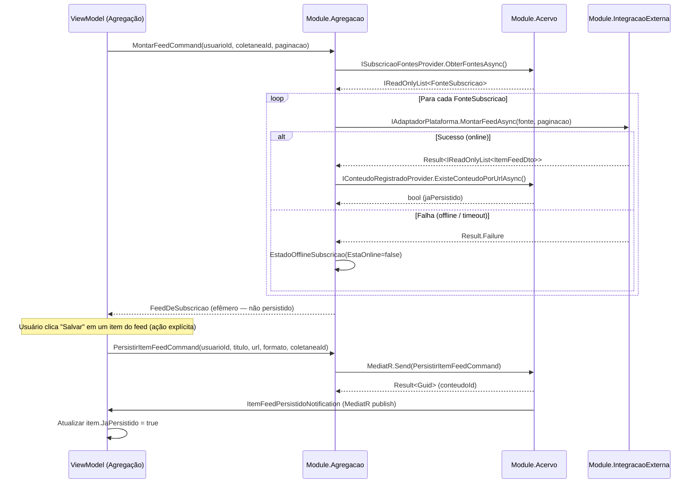

# BC Agregação — Modelo Tático

**Classificação:** Principal (Prioridade 2) — Pilar 2 do sistema  
**Linguagem Ubíqua:** Feed de Subscrição, Agregador Consolidado, Item de Feed, Fonte de Subscrição, Persistência Seletiva, Visão Efêmera  
**Projeto .NET:** `DiarioDeBordo.Module.Agregacao`  
**Interfaces consumidas de:** `DiarioDeBordo.Core` (implementadas em `DiarioDeBordo.Module.Acervo` e `DiarioDeBordo.Module.IntegracaoExterna`)

---

## Característica Central: Sem Persistência Própria

O BC Agregação **não tem repositórios nem entidades persistidas próprias**. Toda a sua operação produz visões efêmeras — computadas em memória durante o ciclo de um request e descartadas depois.

A única escrita ao banco que o BC Agregação realiza é via delegação ao BC Acervo através do comando `PersistirItemFeedCommand`. Esse comando é enviado **exclusivamente** por ação explícita do usuário — o feed **nunca** persiste automaticamente.

**Justificativa da decisão arquitetural:** Esta ausência intencional de persistência decorre de dois princípios do domínio:

1. **Uso Saudável (Padrões Técnicos v4, seção 5.4):** O sistema não deve manter estado de consumo implícito. Um item de feed visto não é um item consumido — só a interação do usuário define isso.
2. **Separação Registro vs. Visão (Padrões Técnicos v4, seção 5.5):** `FeedDeSubscricao` e `AgregadorConsolidado` são Visões — montadas sob demanda, sem `DbSet<T>`, sem tabela. `Conteudo` é um Registro — entidade persistida do BC Acervo.

> **Regra:** `ItemFeedDto` **não tem** `DbSet<ItemFeedDto>`. Qualquer proposta de persistir feeds automaticamente viola invariante IA-01 e o princípio de Uso Saudável.

---

## Conceitos do Domínio (Visões Efêmeras)

| Conceito | Natureza | Ciclo de vida |
|---|---|---|
| `FeedDeSubscricao` | Visão efêmera | Computada em memória por request; nunca persistida |
| `AgregadorConsolidado` | Visão efêmera | Consolidação de múltiplos `FeedDeSubscricao`; nunca persistida |
| `ItemFeedDto` | DTO imutável | Em memória durante o ciclo de request; sem `DbSet<T>` |
| `FiltroAgregador` | Value Object (parâmetro de entrada) | Entrada do request; não persistido |
| `EstadoOfflineSubscricao` | Value Object (indicador) | Calculado em runtime; não persistido |

**Nenhum destes conceitos tem tabela no banco de dados.** O BC Agregação não tem `DbContext` próprio, não tem migrations e não tem repositórios.

---

## DTOs e Value Objects

```csharp
// Item de feed — imutável, efêmero, sem DbSet:
public sealed record ItemFeedDto(
    string IdExterno,           // ID na plataforma de origem
    string Titulo,
    string? Descricao,
    string? UrlFonte,
    string? ThumbnailUrl,
    FormatoMidia Formato,
    string Plataforma,          // "youtube", "rss", "instagram"
    DateTimeOffset? PublicadoEm,
    bool JaPersistido           // true se já existe Conteudo no Acervo para este item
);

// Parâmetros de filtro do agregador:
public sealed record FiltroAgregador(
    Guid? FiltrarPorFonteId,
    bool EsconderConsumidos,
    IReadOnlyList<string> PalavrasChaveExcluir,
    OrdemAgregador Ordem        // CronologicoDecrescente (padrão), CronologicoAscendente
);

// Indicador de estado offline de uma subscrição:
public sealed record EstadoOfflineSubscricao(
    Guid ColetaneaId,
    bool EstaOnline,
    int ItensCachedDisponiveisOffline
);

// Parâmetros de paginação — obrigatórios (invariante IA-03):
public sealed record PaginacaoParams(int Pagina, int TamanhoPagina);
```

---

## Interfaces Consumidas de Outros BCs

Todas definidas em `DiarioDeBordo.Core`. O BC Agregação depende dessas interfaces mas não as implementa — depende de inversão de dependência (DI) para receber as implementações.

### De `DiarioDeBordo.Module.Acervo`

```csharp
// Lê as fontes configuradas em uma coletânea Subscrição:
public interface ISubscricaoFontesProvider
{
    Task<IReadOnlyList<FonteSubscricao>> ObterFontesAsync(
        Guid usuarioId, Guid coletaneaSubscricaoId, CancellationToken ct);
}

public sealed record FonteSubscricao(
    Guid FonteId,
    string Tipo,        // "rss", "youtube", "instagram"
    string Valor,       // URL ou identificador
    string? Plataforma
);

// Verifica se um ItemFeed já foi persistido como Conteudo (deduplicação):
public interface IConteudoRegistradoProvider
{
    Task<bool> ExisteConteudoPorUrlAsync(
        Guid usuarioId, string urlNormalizada, CancellationToken ct);

    Task<bool> ExisteConteudoPorIdentificadorAsync(
        Guid usuarioId, string plataforma, string identificador, CancellationToken ct);
}
```

### De `DiarioDeBordo.Module.IntegracaoExterna`

```csharp
// Busca itens de feed de plataformas externas — sem métricas sociais (invariante IA-04):
public interface IAdaptadorPlataforma
{
    bool SuportaPlataforma(string tipo);

    Task<Result<IReadOnlyList<ItemFeedDto>>> MontarFeedAsync(
        FonteSubscricao fonte, PaginacaoParams paginacao, CancellationToken ct);

    Task<Result<MetadadosExternosDto?>> ObterMetadadosAsync(
        string urlOuIdentificador, string plataforma, CancellationToken ct);
}
```

---

## Command Enviado ao BC Acervo

```csharp
// Definido em DiarioDeBordo.Core — BC Agregação envia, BC Acervo trata:
public sealed record PersistirItemFeedCommand(
    Guid UsuarioId,
    string Titulo,
    string? Descricao,
    string? UrlFonte,
    string? ThumbnailUrl,
    FormatoMidia Formato,
    Guid ColetaneaSubscricaoId
) : IRequest<Result<Guid>>;
// Retorna: Guid do Conteudo criado ou existente (deduplicação transparente no handler do Acervo)

// Quando publicado: APENAS por ação explícita do usuário (salvar, marcar, anotar item do feed)
// NUNCA automático — nenhum item persiste sem interação do usuário (invariante IA-01)
```

**Notificação publicada pelo Acervo após persistência:**

```csharp
// Publicada via MediatR pelo handler do Acervo após persistir com sucesso:
public sealed record ItemFeedPersistidoNotification(
    Guid ConteudoId,
    string Titulo
) : INotification;
// O ViewModel de Agregação implementa INotificationHandler<ItemFeedPersistidoNotification>
// para atualizar o estado visual do item (JaPersistido = true) sem rebuild do feed.
```

---

## Invariantes do BC Agregação

| # | Invariante | Consequência de violação |
|---|---|---|
| IA-01 | **Sem persistência automática** — nenhum item de feed persiste sem interação explícita do usuário | `PersistirItemFeedCommand` é enviado somente por ação do usuário no ViewModel; nunca por evento de background |
| IA-02 | **Feed montado sob demanda** — não é cacheado no banco de dados | Toda navegação ao feed dispara `IAdaptadorPlataforma.MontarFeedAsync`; ausência de tabela de cache |
| IA-03 | **Sem scroll infinito** — paginação obrigatória em toda consulta | `PaginacaoParams` é parâmetro obrigatório; ausência causa exceção de domínio |
| IA-04 | **Sem métricas sociais** — likes, views e comentários de terceiros não aparecem | `ItemFeedDto` não inclui campos de métricas sociais; adaptadores não expõem esses dados |
| IA-05 | **Sem algoritmo de ranqueamento** — ordem cronológica apenas | `FiltroAgregador.Ordem` aceita somente `CronologicoDecrescente` ou `CronologicoAscendente` |
| IA-06 | **Comportamento offline** — exibir apenas itens já persistidos e sinalizar incompletude | `EstadoOfflineSubscricao.EstaOnline == false` → filtrar para `ItemFeedDto` com `JaPersistido == true` + notificação visual |

---

## Fluxo: Montar Feed de Subscrição

```
Input: UsuarioId, ColetaneaSubscricaoId, PaginacaoParams

1. ISubscricaoFontesProvider.ObterFontesAsync(usuarioId, coletaneaId)
   → IReadOnlyList<FonteSubscricao>
   (tipos: "rss", "youtube", "instagram", etc.)

2. Para cada FonteSubscricao:
   a. Selecionar IAdaptadorPlataforma onde SuportaPlataforma(fonte.Tipo) == true
   b. IAdaptadorPlataforma.MontarFeedAsync(fonte, paginacao, ct)
      → Result<IReadOnlyList<ItemFeedDto>>
      - Se Result.IsSuccess: lista de itens (sem métricas sociais)
      - Se Result.IsFailure (timeout, erro de rede): EstadoOfflineSubscricao(EstaOnline=false)

3. Para cada ItemFeedDto retornado com sucesso:
   a. IConteudoRegistradoProvider.ExisteConteudoPorUrlAsync(usuarioId, item.UrlFonte)
      OU ExisteConteudoPorIdentificadorAsync(usuarioId, item.Plataforma, item.IdExterno)
   b. Construir novo ItemFeedDto com JaPersistido = (resultado da verificação)

4. Retornar FeedDeSubscricao (lista efêmera de ItemFeedDto com metadados de paginação)

Tratamento offline (invariante IA-06):
   → Se EstadoOfflineSubscricao.EstaOnline == false:
     Retornar apenas ItemFeedDto onde JaPersistido == true
     Sinalizar no ViewModel: "Feed indisponível offline — exibindo apenas conteúdos salvos"
```

---

## Fluxo: Montar Agregador Consolidado

```
Input: UsuarioId, IReadOnlyList<ColetaneaSubscricaoId>, FiltroAgregador, PaginacaoParams

1. Para cada ColetaneaSubscricaoId:
   Executar fluxo "Montar Feed de Subscrição" (acima)
   → FeedDeSubscricao (lista de ItemFeedDto por coletânea)

2. Consolidar: achatar todos os ItemFeedDto em uma lista única
   (preservar metadado de origem — ColetaneaId — em cada ItemFeedDto)

3. Aplicar FiltroAgregador:
   a. FiltrarPorFonteId → manter apenas ItemFeedDto cuja fonte corresponde ao FonteId
   b. EsconderConsumidos → remover itens onde JaPersistido == true
      E Conteudo.Progresso.Estado == Concluido (consulta adicional a IConteudoRegistradoProvider)
   c. PalavrasChaveExcluir → remover ItemFeedDto onde Titulo ou Descricao
      contém qualquer palavra da lista (case-insensitive)

4. Ordenar por PublicadoEm conforme FiltroAgregador.Ordem:
   - CronologicoDecrescente (padrão): mais recentes primeiro
   - CronologicoAscendente: mais antigos primeiro
   Itens sem PublicadoEm ficam no final

5. Paginar resultado: PaginatedList<ItemFeedDto>(lista, paginacao)

6. Retornar AgregadorConsolidado (visão efêmera — descartada após o request)
```

---

## Diagrama de Colaboração (Mermaid)



---

## Cenários do Apêndice A Cobertos

### Cenário 6: "Seguir criadores no YouTube e Instagram sem scroll infinito, sem likes, sem algoritmo"

**Contexto:** Usuário quer acompanhar criadores de conteúdo externo sem ser submetido a mecânicas de engajamento.

**Caminho no modelo:**

1. Usuário cria `Conteudo` com `Papel = Coletanea`, `TipoColetanea = Subscricao` no BC Acervo para cada criador (ex.: canal YouTube, perfil Instagram)
2. Adiciona `Fonte` com `Tipo = Url` (canal YouTube) ou `Tipo = Identificador` (@ do Instagram) à coletânea de subscrição via BC Acervo
3. No BC Agregação, o Agregador consolida todas as subscrições: executa fluxo "Montar Agregador Consolidado"
4. `IAdaptadorPlataforma` (implementado em `Module.IntegracaoExterna`) busca itens — `ItemFeedDto` **não inclui** campos de métricas sociais (invariante IA-04 aplicada no contrato da interface)
5. Paginação obrigatória via `PaginacaoParams` (invariante IA-03) — scroll infinito é impossível por design: sem `PaginacaoParams`, o fluxo lança exceção
6. Opção `FiltroAgregador.EsconderConsumidos = true` disponível — usuário controla o que aparece sem depender de algoritmo de relevância
7. Ordenação exclusivamente cronológica — `FiltroAgregador.Ordem` não aceita "por popularidade" ou similar (invariante IA-05)

**Lacuna condicional:** Instagram pode bloquear acesso via API → `IAdaptadorPlataforma.MontarFeedAsync` retorna `Result.Failure` com código de erro → `EstadoOfflineSubscricao` sinaliza fonte indisponível → ViewModel exibe mensagem "fonte indisponível" por item, sem crash do agregador

**Entidades/interfaces envolvidas:** `FeedDeSubscricao`, `AgregadorConsolidado`, `ItemFeedDto`, `FiltroAgregador`, `IAdaptadorPlataforma`, `ISubscricaoFontesProvider`, `EstadoOfflineSubscricao`

---

### Cenário 7: "Primeiro uso do sistema sem internet"

**Contexto:** Usuário abre o sistema pela primeira vez em ambiente sem conectividade.

**Caminho no modelo:**

1. Todas as subscrições configuradas (ou nenhuma, no caso de primeiro uso) tentam montar feed
2. `IAdaptadorPlataforma.MontarFeedAsync` retorna `Result.Failure` (erro de rede / timeout) para todas as fontes
3. `EstadoOfflineSubscricao(EstaOnline=false, ItensCachedDisponiveisOffline=0)` calculado para todas as subscrições
4. Fluxo "Montar Feed de Subscrição" aplica invariante IA-06: retorna apenas `ItemFeedDto` com `JaPersistido=true` → vazio no primeiro uso (nenhum item foi salvo ainda)
5. `AgregadorConsolidado` retornado é vazio, com metadado de status offline por subscrição
6. ViewModel exibe notificação: "Feed indisponível offline — conecte-se para ver novos itens. Conteúdos salvos estão disponíveis na Biblioteca."
7. **Pilar 1 (Acervo) funciona integralmente** — o usuário pode criar conteúdos manualmente, organizar coletâneas Guiadas/Miscelânea, navegar pelo acervo existente — sem depender de conectividade

**Propriedade garantida:** O usuário nunca vê tela de erro catastrófico; sempre vê uma interface funcional parcial com explicação clara do que está indisponível e por quê.

**Entidades/interfaces envolvidas:** `EstadoOfflineSubscricao`, `AgregadorConsolidado`, `FeedDeSubscricao`, `ItemFeedDto` (lista vazia), `IAdaptadorPlataforma` (retorna falha), `ISubscricaoFontesProvider`

---

## Mapeamento de Invariantes → Testes Futuros (Phase 6)

| Invariante | Método de teste previsto |
|---|---|
| IA-01: Sem persistência automática | `AgregacaoTests.ItemFeedSemInteracaoUsuario_NaoPersiste()` |
| IA-02: Feed sob demanda | `AgregacaoTests.MontarFeed_NaoCachaNobanco()` |
| IA-03: Paginação obrigatória | `AgregacaoTests.MontarFeedSemPaginacao_LancaException()` |
| IA-04: Sem métricas sociais | `AgregacaoTests.ItemFeedDto_NaoContemCamposMetricasSociais()` |
| IA-05: Sem ranqueamento | `AgregacaoTests.MontarFeed_OrdemSempreEhCronologica()` |
| IA-06: Comportamento offline | `AgregacaoTests.Offline_ExibeApenasItensPersistidos()` |
| Deduplicação transparente | `AgregacaoTests.PersistirItemFeedDuplicado_RetornaIdExistente()` |
| Cenário 6: sem scroll infinito | `AgregacaoTests.Cenario6_ScrollInfinito_Impossivel()` |
| Cenário 7: primeiro uso offline | `AgregacaoTests.Cenario7_PrimeiroUsoOffline_FeedVazio_SemCrash()` |

---

## Referências

- Definição de Domínio v3, seção 5.2 (Agregador) e Apêndice A (Cenários 6 e 7)
- Padrões Técnicos v4, seção 5.5 (Registro vs. Visão) — implementação técnica da distinção
- Padrões Técnicos v4, seção 6.5 (Persistência Seletiva — ItemFeed → Conteúdo)
- Padrões Técnicos v4, seção 7.1 (Mapa de Módulos .NET)
- Mapa de Contexto v1, seção 2.1 (interações que disparam persistência seletiva)
- 01-RESEARCH.md, seção 1.2 (BC Agregação sem repositórios próprios)
