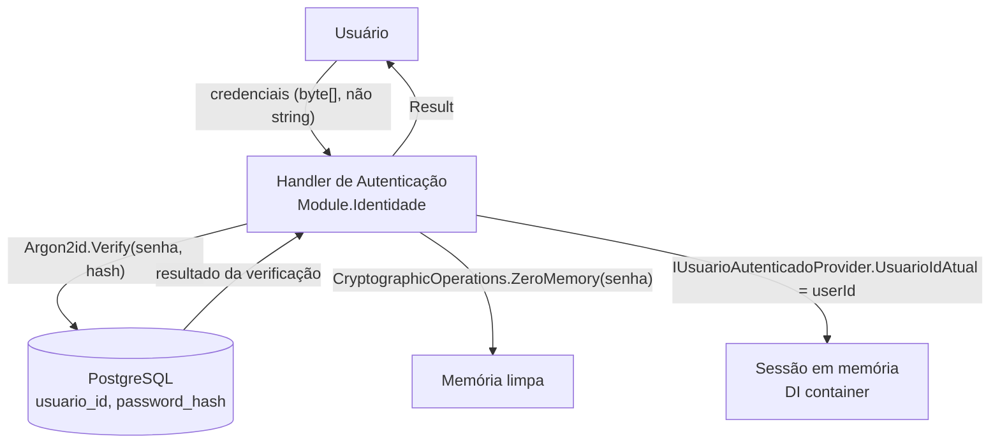
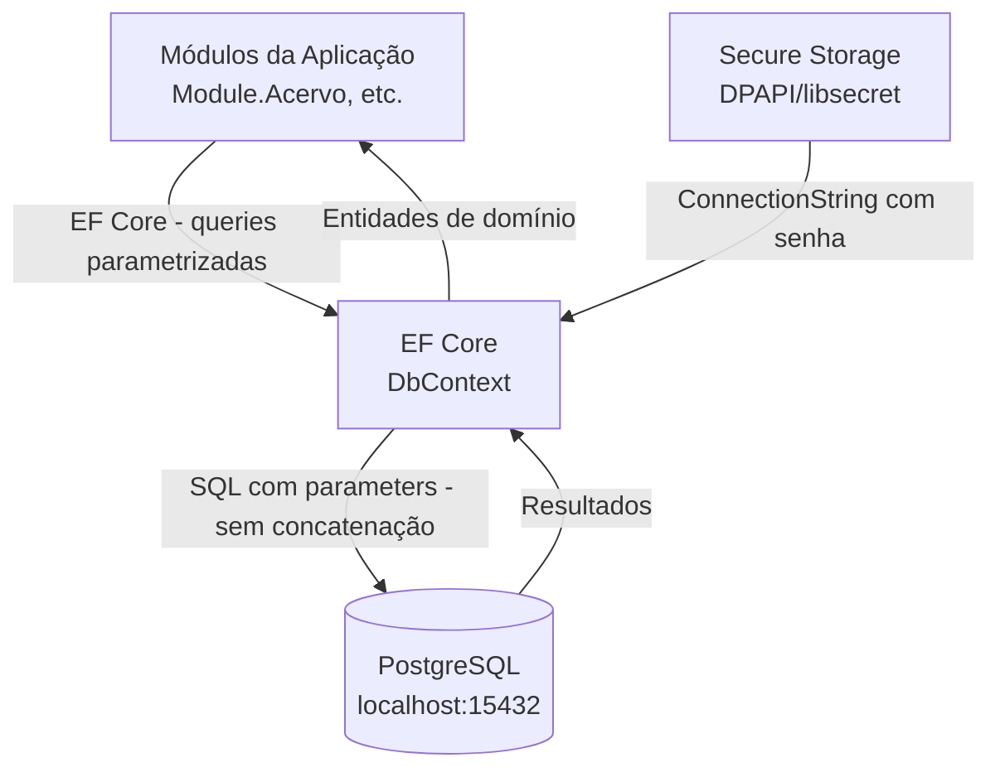
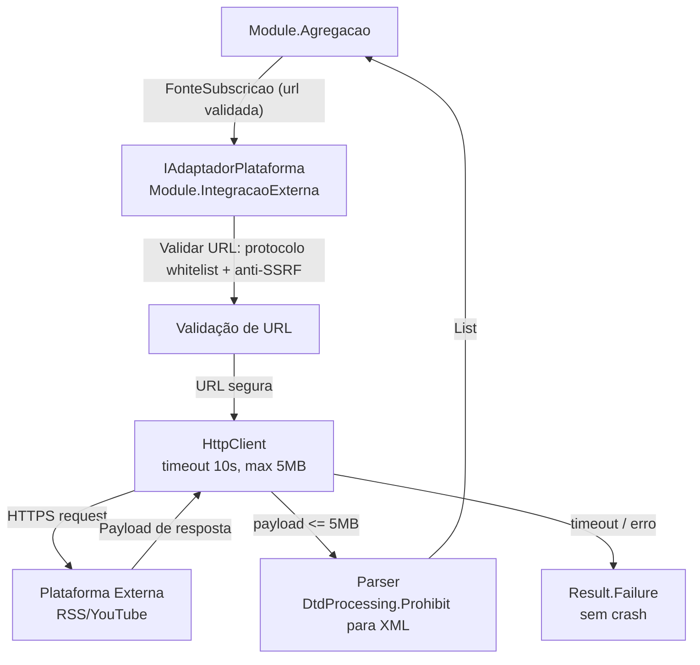
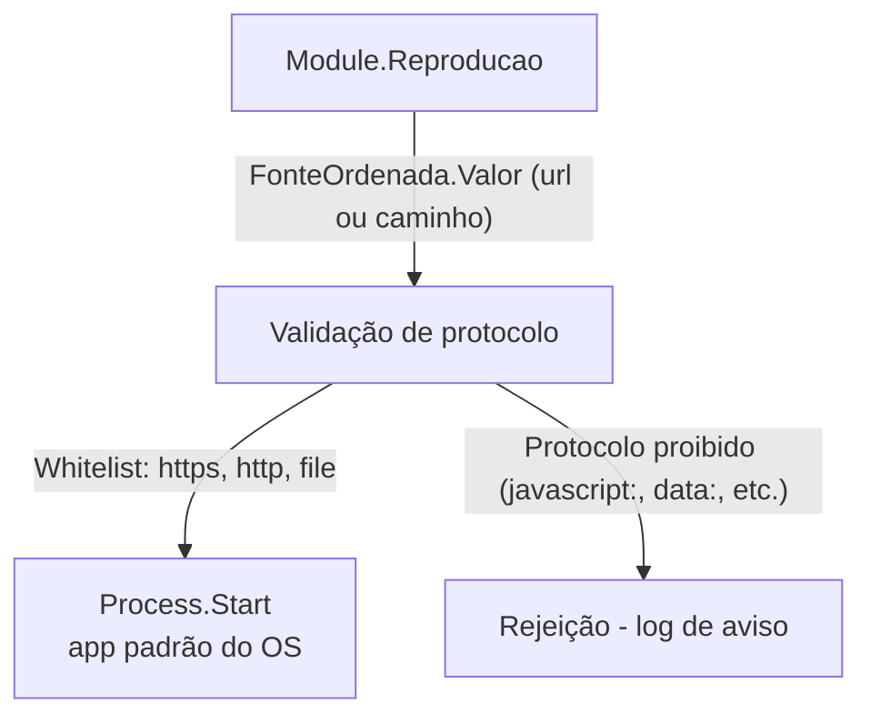
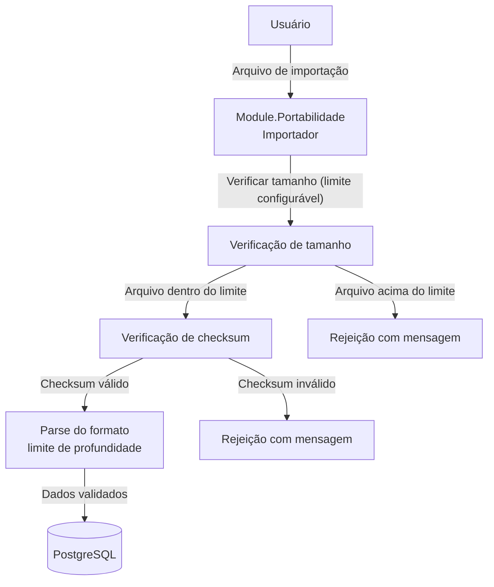

# DFD Nível 1 — Detalhamento por Subsistema

**Referência:** Veja `overview.md` para DFD nível 0 e escopo geral.

---

## Subsistema 1: Autenticação



**Trust boundary:** Processo da aplicação → processo do PostgreSQL (mesmo host, porta 15432)
**Entradas:** Credenciais do usuário (byte[])
**Saídas:** Token de sessão em memória (Guid do usuário)
**Dados sensíveis em trânsito:** Senha em memória — nunca serializada, zerada após uso com `CryptographicOperations.ZeroMemory()`

**Proteções:**
- Argon2id para hashing de senhas (resistente a GPU e ASIC)
- `CryptographicOperations.FixedTimeEquals()` para comparação de hashes (previne timing attacks)
- Senha manipulada como `byte[]`, nunca `string` (evita fixação no heap do GC)
- `CryptographicOperations.ZeroMemory()` após uso

---

## Subsistema 2: Banco de Dados



**Trust boundary:** Processo da aplicação → PostgreSQL (localhost)
**Invariante de segurança:** Todo acesso inclui `WHERE usuario_id = @usuarioId` — sem exceções
**Proteções:**
- EF Core usa queries parametrizadas — BannedSymbols.txt proíbe concatenação de SQL
- ConnectionString nunca em arquivos de configuração — somente no Secure Storage do OS (DPAPI no Windows, libsecret no Linux)
- Porta 15432 (não-padrão) + credenciais fortes geradas na instalação
- `PaginatedList<T>` obrigatório em todas as listagens — previne DoS por consultas sem paginação

---

## Subsistema 3: Adaptadores de Rede



**Trust boundary:** Processo da aplicação → Internet (untrusted)
**Proteções obrigatórias (todas invioláveis):**
- `DtdProcessing.Prohibit` em todo XML/RSS — previne XXE (XML External Entity attacks)
- Limite 5MB por payload — previne DoS por resposta gigante
- Timeout 10s — previne DoS por resposta lenta
- Validação pós-resolução DNS: rejeitar IPs privados (10.x, 192.168.x, 127.x, 172.16–31.x, ::1, 169.254.x) — previne SSRF
- Whitelist de protocolos: `https`, `http`, `file` apenas — rejeitar tudo mais
- Circuit breaker após N falhas consecutivas — previne hammering de fontes indisponíveis

**Anti-SSRF — validação após DNS resolution (obrigatório):**
```
1. Resolver hostname → endereço IP
2. Verificar IP contra lista de ranges privados:
   - 10.0.0.0/8
   - 172.16.0.0/12
   - 192.168.0.0/16
   - 127.0.0.0/8
   - 169.254.0.0/16 (link-local)
   - ::1/128 (IPv6 loopback)
3. Se IP privado → rejeitar com Result.Failure("URL aponta para rede privada")
4. NUNCA usar apenas validação de hostname (bypass por DNS rebinding)
```

---

## Subsistema 4: Reprodutor Externo



**Trust boundary:** Processo da aplicação → OS (Process.Start)
**Proteção:** Whitelist estrita de protocolos antes de qualquer `Process.Start`

**Lógica de validação:**
```
Protocolo permitido: ["https", "http", "file"]
Se protocolo não está na whitelist → rejeitar, logar aviso
Nunca: javascript:, data:, vbscript:, ftp:, smb:
```

---

## Subsistema 5: Importação de Arquivos



**Trust boundary:** Sistema de arquivos (potencialmente manipulado) → Processo da aplicação
**Proteções:**
- Verificação de tamanho antes do parse (previne DoS por arquivo gigante)
- Checksum de integridade antes de processar (previne arquivos corrompidos/adulterados)
- Limite de profundidade de nesting no JSON (previne JSON bomb)
- Path traversal prevention: canonicalizar caminhos antes de abrir arquivos

---

## Referências

- `overview.md` — DFD nível 0 e escopo do threat model
- `stride-table.md` — Ameaças mapeadas por subsistema
- Padrões Técnicos v4, seção 4 (segurança)
- ADR-005: Abordagem de Segurança
