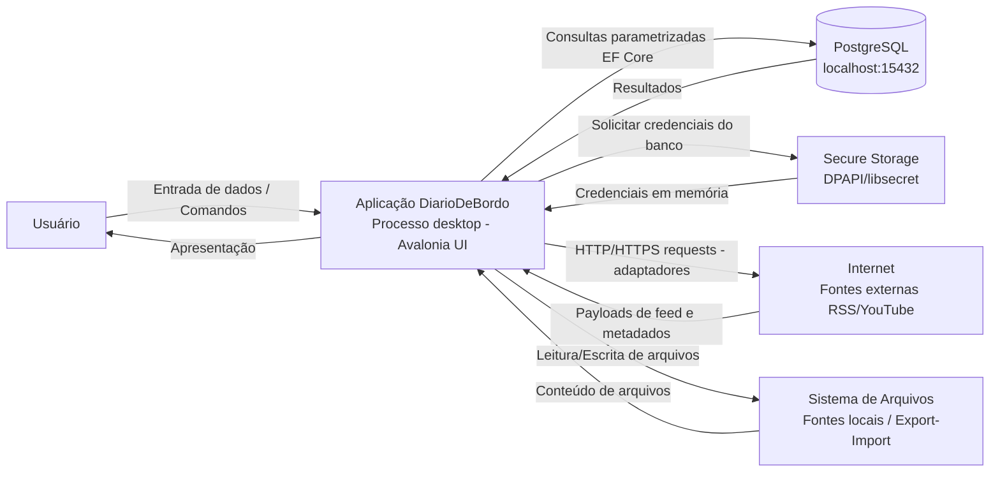

# Threat Model — DiarioDeBordo

**Data:** 2026-04-02
**Versão:** 1.0
**Metodologia:** STRIDE (Spoofing, Tampering, Repudiation, Information Disclosure, Denial of Service, Elevation of Privilege)
**Status:** Criado antes de qualquer código de rede ou persistência — conforme SEG-01

## Propósito

Este documento é a referência base para análise de segurança do sistema DiarioDeBordo. Funciona como ponto de partida para o pentest full scope por milestone (Phase 11, requisito SEG-05).

Documentos complementares:
- `dfd-nivel-1.md` — DFDs detalhados por subsistema
- `stride-table.md` — Tabela STRIDE com todas as ameaças e mitigações rastreáveis

---

## Escopo do Sistema

**O que está no escopo:**
- Aplicação desktop nativa (Avalonia UI) rodando no processo do usuário
- PostgreSQL bundled rodando localmente na porta 15432
- Comunicação in-process via MediatR entre módulos
- Adaptadores HTTP/HTTPS para fontes externas (RSS, YouTube)
- DPAPI/libsecret para armazenamento de credenciais
- Sistema de arquivos local (fontes de arquivo, importação/exportação)

**O que está fora do escopo:**
- Infraestrutura de servidor (sistema é desktop-only)
- Autenticação OAuth/SSO (fora do design)
- Sincronização entre instâncias (fora do design)

---

## DFD Nível 0 — Sistema Completo

O diagrama abaixo representa o sistema em sua totalidade, com as principais entidades externas e fluxos de dados.

**5 superfícies de ataque identificadas:**

| Superfície | Vetor principal | Trust boundary |
|---|---|---|
| 1. Entrada do usuário | UI → Processo | Confiança total (usuário local) |
| 2. Banco de dados | Processo → PostgreSQL localhost:15432 | Processo da aplicação → processo do banco |
| 3. Secure Storage | OS → Processo | OS Keychain/DPAPI → aplicação |
| 4. Rede externa | Processo → Internet | Aplicação → plataformas externas |
| 5. Sistema de arquivos | Processo → FS | Processo → arquivos do usuário |

---

## Características de Segurança do Desktop App

Diferente de web apps, o vetor de ataque principal é **local**:

1. **PostgreSQL na porta 15432:** Outras aplicações no mesmo sistema podem tentar conectar. Mitigação: credenciais geradas na instalação, armazenadas no Secure Storage do OS — não em arquivos de configuração.

2. **Memória:** `CryptographicOperations.ZeroMemory()` após uso de dados sensíveis (senhas, chaves). Senhas em `byte[]`, nunca `string` (strings são imutáveis e podem ficar no GC após coleta).

3. **Binários:** Code signing via Velopack + verificação SHA-256 antes de instalar atualizações.

4. **Arquivos de exportação/importação:** Validar integridade (checksum + tamanho máximo) antes de processar. Rejeitar arquivos que excedam limite configurável.

---

## Referências

- Padrões Técnicos v4, seção 4 (segurança) e Apêndice C (STRIDE de alto nível)
- ADR-005: Abordagem de Segurança
- STRIDE methodology: Microsoft Threat Modeling Tool
