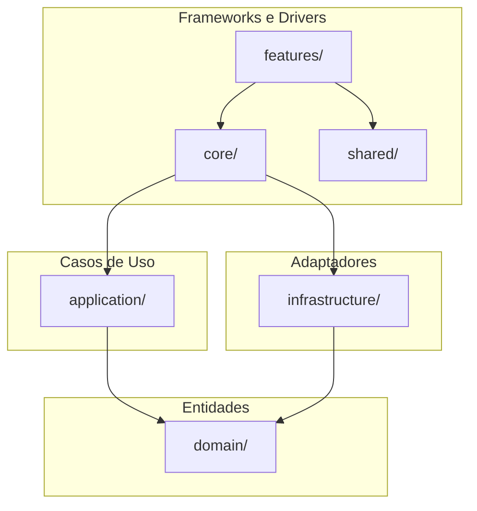

# Frontend — Diário de Bordo

Aplicação Angular 21 que segue **Clean Architecture**, **DDD** e **modularização** (feature modules, core, shared). Execução **on-premise** na máquina do usuário; consome a API do backend (URL configurável em tela pelo admin).

---

## Tecnologias

- **Angular 21** (standalone components, signals-ready)
- **Routing** com lazy loading por feature
- **Estilo:** SCSS
- **Testes unitários:** Karma + Jasmine
- **Testes e2e:** Playwright
- **CI:** GitHub Actions (lint, test, build, e2e não bloqueante)

---

## Diagrama de alto nível (Clean Architecture + DDD)

Direção de dependência: **Frameworks → Adaptadores → Casos de Uso → Entidades**.



| Camada        | Pasta              | Conteúdo |
|---------------|--------------------|----------|
| Entidades     | `app/domain/`      | Modelos de domínio, value objects, interfaces (sem Angular/HTTP). |
| Casos de Uso  | `app/application/` | Serviços de aplicação; dependem de interfaces do domain. |
| Adaptadores   | `app/infrastructure/` | Implementações HTTP, repositórios, DTOs. |
| Core          | `app/core/`        | Singletons: configuração (ex.: URL da API), guards, interceptors. |
| Shared        | `app/shared/`      | Componentes, pipes e diretivas reutilizáveis. |
| Features      | `app/features/`    | Um subdiretório por feature (home, config, …) com módulo e rotas. |

---

## Estrutura de pastas

```
frontend/
├── src/
│   ├── app/
│   │   ├── core/           # Serviços singleton (ex.: ApiConfigService)
│   │   ├── shared/         # Componentes/pipes/diretivas compartilhados
│   │   ├── domain/         # Entidades, value objects, interfaces
│   │   ├── application/    # Casos de uso
│   │   ├── infrastructure/ # Adaptadores (HTTP, repositórios, DTOs)
│   │   ├── features/
│   │   │   ├── home/       # Página inicial
│   │   │   └── config/     # Configurações admin (URL da API)
│   │   ├── app.config.ts
│   │   ├── app.routes.ts
│   │   └── app.component.ts
│   ├── assets/
│   ├── index.html
│   ├── main.ts
│   └── styles.scss
├── e2e/                    # Testes Playwright
├── angular.json
├── package.json
├── tsconfig.json
├── karma.conf.js
└── Dockerfile
```

---

## Guia de execução

### Pré-requisitos

- **Node.js** 20.19+ ou 22+ (exigido pelo Angular 21)
- **npm** (ou outro gestor compatível)

### Instalação e desenvolvimento

```bash
cd frontend
npm ci
npm start
```

A aplicação fica em **http://localhost:4200**.

### Build de produção

```bash
npm run build
```

Artefatos em `dist/frontend/browser/`.

### Testes

- **Unitários (Karma):**  
  `npm run test`  
  (em CI: `ChromeHeadless`; local: pode usar `Chrome`)

- **Cobertura:**  
  `npm run test:coverage`

- **e2e (Playwright):**  
  `npm run e2e`  
  (com app rodando em `http://localhost:4200` ou com `webServer` no `playwright.config.ts`)

### Lint

```bash
npm run lint
```

---

## Configuração da URL da API

A **URL da API** (backend) é configurada **em tela por um usuário administrador**:

1. Abra a aplicação no navegador.
2. Acesse o menu **Configurações** (rota `/config`).
3. Informe a URL base do backend (ex.: `https://api.seudominio.com`).
4. Clique em **Salvar**.

O valor é armazenado no **localStorage** do navegador e usado por serviços que chamam a API. Não é definida por variável de ambiente no build.

---

## One-click com Docker

Para subir o frontend em container (sem instalar Node localmente):

```bash
# Na raiz do repositório
docker-compose -f docker/docker-compose.yml up -d
```

O frontend fica disponível em **http://localhost:4200**. Configure a URL da API em **Configurações** após abrir a aplicação.

Detalhes do Docker e do repositório estão no [README principal](../README.md).
