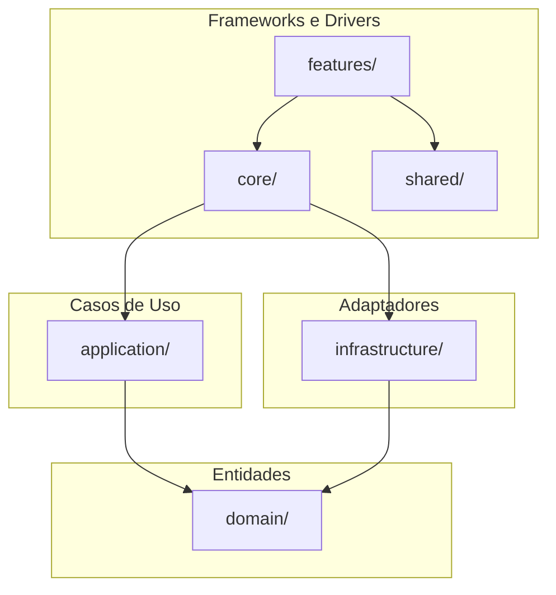

# Frontend — Diário de Bordo

Aplicação Angular 21 que segue **Clean Architecture**, **DDD** e **modularização** (feature modules, core, shared). Execução **on-premise** na máquina do usuário; consome a API do backend (URL configurável em tela pelo admin).

> **Convenções de código**: componentes Angular usam **`templateUrl` + `styleUrl`** com arquivos `.html` e `.scss` dedicados por padrão. A arquitetura de camadas (`domain/`, `application/`, `infrastructure/`) é introduzida de forma progressiva quando o conteúdo real justificar — não como estrutura de pastas vazia. Detalhes em [regras/angular-frontend.mdc](../regras/angular-frontend.mdc).

---

## Tecnologias

- **Angular 21** (standalone components, signals-ready)
- **Routing** com lazy loading por feature
- **Estilo:** SCSS
- **Testes unitários:** Karma + Jasmine
- **Testes e2e:** Playwright
- **CI:** GitHub Actions (lint, test, build, e2e não bloqueante)

---

## Diagrama de alto nível (Clean Architecture + DDD)

Direção de dependência: **Frameworks → Adaptadores → Casos de Uso → Entidades**.

> **Estado atual**: apenas as camadas de Frameworks e Drivers (`core/`, `features/`, `shared/`) estão ativas. As camadas de Adaptadores, Casos de Uso e Entidades serão preenchidas progressivamente quando features de domínio (obras, partes, situações) forem implementadas.



| Camada        | Pasta              | Conteúdo |
|---------------|--------------------|----------|
| Core          | `app/core/`        | Singletons: configuração (ex.: URL da API), guards, interceptors. |
| Shared        | `app/shared/`      | Componentes, pipes e diretivas reutilizáveis. |
| Features      | `app/features/`    | Um subdiretório por feature (home, config, …) com componente, rotas e testes. |

> **Camadas futuras**: `app/domain/`, `app/application/` e `app/infrastructure/` serão introduzidas quando existirem modelos de domínio (Obra, Parte, Situação) e chamadas à API no frontend. Nesse momento, serviços de page devem migrar para essas camadas conforme [regras/angular-frontend.mdc](../regras/angular-frontend.mdc). Enquanto não existirem, essas pastas não são criadas (evitar estruturas vazias).

---

## Estrutura de pastas

```
frontend/
├── src/
│   ├── app/
│   │   ├── core/                   # Serviços singleton (ex.: ApiConfigService)
│   │   │   ├── api-config.service.ts
│   │   │   └── api-config.service.spec.ts
│   │   ├── shared/                 # Componentes/pipes/diretivas compartilhados
│   │   ├── features/
│   │   │   ├── home/               # Página inicial
│   │   │   │   ├── home.component.ts
│   │   │   │   ├── home.component.html
│   │   │   │   ├── home.component.scss
│   │   │   │   └── home.routes.ts
│   │   │   └── config/             # Configurações admin (URL da API)
│   │   │       ├── config.component.ts
│   │   │       ├── config.component.html
│   │   │       ├── config.component.scss
│   │   │       ├── config.component.spec.ts
│   │   │       └── config.routes.ts
│   │   ├── app.config.ts
│   │   ├── app.routes.ts
│   │   ├── app.component.ts
│   │   ├── app.component.html
│   │   ├── app.component.scss
│   │   └── app.component.spec.ts
│   ├── assets/
│   ├── index.html
│   ├── main.ts
│   └── styles.scss
├── e2e/                            # Testes Playwright
├── angular.json
├── package.json
├── tsconfig.json
├── karma.conf.js
└── Dockerfile
```

---

## Guia de execução

### Pré-requisitos

- **Node.js** 20.19+ ou 22+ (exigido pelo Angular CLI 21 para `npm install`, `npm run test`, `npm run build` e `ng serve`)
- **npm** (ou outro gestor compatível)

Se usar **nvm**, execute `nvm use` na pasta `frontend/` para ativar a versão definida em `.nvmrc` (Node 22).

### Instalação e desenvolvimento

```bash
cd frontend
npm ci
npm start
```

A aplicação fica em **http://localhost:4200**.

### Build de produção

```bash
npm run build
```

Artefatos em `dist/frontend/`.

### Testes

- **Unitários (Karma):**  
  `npm run test`  
  (em CI: `ChromeHeadless`; local: pode usar `Chrome`)

- **Cobertura:**  
  `npm run test:coverage`

- **e2e (Playwright):**  
  `npm run e2e`  
  (com app rodando em `http://localhost:4200` ou com `webServer` no `playwright.config.ts`)

### Lint

```bash
npm run lint
```

---

## Configuração da URL da API

A **URL da API** (backend) é configurada **em tela por um usuário administrador**:

1. Abra a aplicação no navegador.
2. Acesse o menu **Configurações** (rota `/config`).
3. Informe a URL base do backend (ex.: `https://api.seudominio.com`).
4. Clique em **Salvar**.

O valor é armazenado no **localStorage** do navegador e usado por serviços que chamam a API. Não é definida por variável de ambiente no build.

---

## Execução via containerização (one-click)

O frontend pode ser executado **sem instalar Node.js** na máquina, usando Docker. Estratégia **one-click**: um único comando na raiz do repositório sobe o container, faz o build da aplicação e expõe a interface na porta 4200.

### Pré-requisitos

- **Docker** e **Docker Compose** instalados (ex.: [Docker Desktop](https://www.docker.com/products/docker-desktop/)).

### One-click: subir o frontend

Na **raiz do repositório** (não dentro de `frontend/`):

```bash
docker compose -f docker/docker-compose.yml up -d --build
```

- **`up -d`** — sobe o serviço em segundo plano (detached).
- **`--build`** — garante que a imagem seja (re)construída com o código atual (útil na primeira vez ou após alterações).

O primeiro build pode levar alguns minutos (download da imagem Node, `npm ci`, `ng build`). Os seguintes tendem a ser mais rápidos por uso de cache.

### Acesso à aplicação

- **URL:** [http://localhost:4200](http://localhost:4200)
- A porta **4200** do host é mapeada para a porta 80 do nginx dentro do container.

Após abrir no navegador, configure a URL da API em **Configurações** (menu da aplicação), se necessário.

### Comandos úteis

| Objetivo | Comando (na raiz do repo) |
|----------|---------------------------|
| Subir (e construir se precisar) | `docker compose -f docker/docker-compose.yml up -d --build` |
| Parar o container | `docker compose -f docker/docker-compose.yml down` |
| Ver logs | `docker compose -f docker/docker-compose.yml logs -f frontend` |
| Reconstruir após mudar código | `docker compose -f docker/docker-compose.yml up -d --build` |

### O que acontece no one-click

1. O **Dockerfile** do frontend (multi-stage) usa Node 22 para instalar dependências e rodar `ng build`.
2. O resultado do build é copiado para uma imagem **nginx:alpine**, que serve os arquivos estáticos.
3. O **docker-compose** orquestra o build e a exposição da porta 4200.

Não é necessária variável de ambiente no container para a URL da API; ela é configurada em tela pelo usuário admin (localStorage).

Detalhes do Docker e do repositório estão no [README principal](../README.md).
